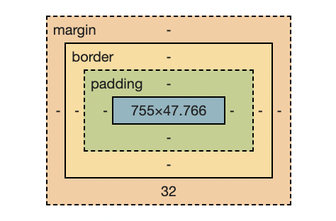

# 박스 모델 (Box Model)

> 22.09.08

 

## 박스의 구성

- HTML 문서 내 요소들은 박스로 표현된다.
- contents, padding, border, margin 으로 이루어진다.

</img>

 

## 박스 유형

### 1. block 박스

- 가용 공간의 양옆을 다 차지한다.
- width와 height로 컨트롤 할 수 있다.
- padding, margin, border 속성을 사용하여 스타일을 컨트롤 할 수 있고, 해당 속성들이 다른 요소들을 밀어낸다.

> `box-sizing: border-box`
>
> border 기준으로 width와 height를 잡는다.
> 해당 속성을 설정하지 않을 경우 기본값은 content-box이고, content의 영역만이 설정한 width와 height를 갖는다.

 

### 2. inline 박스

- 콘텐츠 박스만큼의 크기를 갖는다. 한 줄에 여러 요소가 존재한다.
- width, height 속성을 사용할 수 없다.
- padding, border는 사용 가능, margin은 좌우만 조절 가능하다.
- 해당 속성들의 상하값들은 다른 요소를 밀어내지 않는다.

 

### 3. inline-block 박스

- inline 속성의 특징과 block 속성의 특징이 함께 존재하는 박스
- inline 처럼 한 줄에 여러 요소가 존재한다.
- block 처럼 width, height, margin, padding 등 모든 값을 지정할 수 있다.

 

# 새롭게 알게된 것

## `` vs `
`의 background-image 속성

### `` 태그로 써야 하는 것?

- 백엔드 입장에서 컨트롤되는 이미지
- 유저들(ex. 스크린 리더)에게 설명될 필요가 있는 이미지

 

### `background-image`로 써야 하는 것?

- 변경되지 않을 이미지
- 백엔드에서 컨트롤하지 않아도 되는 이미지
