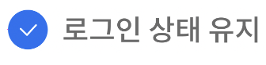
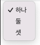
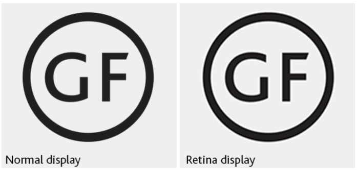

# CSS 실무 테크닉

## 1. 커스텀 Input, select 박스

- 기본 input, select 박스들이 각 브라우저에서 다른 스타일을 갖고 표현된다. 따라서 디자인적 개성을 주기 위해 실무에서 input 요소나 select 박스를 브라우저 스타일과 다르게 표현하곤 한다.
- 직접 input 요소나 select 박스를 스타일링 하는 것은 어려워서 다음의 방법들로 커스텀을 많이 한다.

<br>

### checkbox 커스텀하기



- **label의 가상요소**로 커스텀된 input checkbox를 만든다.

```html
<!-- input checkbox와 label로 제작하기 -->
<input type="checkbox" id="inpHold" class="inp-hold txt-hide" />
<label for="inpHold" class="labl-hold">로그인 상태 유지</label>
```

```css
.txt-hide {
  position: absolute;
  clip: rect(0 0 0 0);
  width: 1px;
  height: 1px;
  margin: -1px;
  overflow: hidden;
}

.labl-hold::before {
  vertical-align: -5px;
  display: inline-block;
  content: " ";
  width: 22px;
  height: 22px;
  background-image: url("images/icon_check_empty.png");
}
/* input 요소가 체크되었을 때, label의 가상 요소를 선택하고 이미지를 바꿔라 */
.inp-hold:checked + .labl-hold::before {
  background-image: url("images/icon_check.png");
}
.inp-hold:focus + .labl-hold::before {
  outline: 2px solid #000; /* 웹 접근성을 위해 포커싱에 아웃라인을 추가 */
	outline-offset: 5px; /* 5px 만큼의 원안에 여유를 가짐(오프셋), 티를 낼 수 있다!
	border-radius: 50%;
}
```

> Q. contents안에 이미지를 넣으면 어떻게 되나요?
>
> - contents 안에 넣어도 동작은 하지만 스크린 리더는 contents 안에 있는 이미지를 '이미지'라고 읽는다. 따라서,background-image를 쓰는 것이 웹 접근성 측면에서는 더 적절하다.

<br>

> 📓 outline: 레이아웃에 영향을 미치지 않는 css 스타일
>
> border: 박스 모델의 요소이기 때문에 레이아웃에 영향을 준다. (밀리거나)

</aside>

<br>

### select 커스텀

chrome에서 기본 select box 스타일  
  


- select 박스도 마찬가지로 브라우저마다 스타일이 다르고, 스타일 지정이 어렵다.
- 모바일에서는 운영체제마다 모양이 달라서 보통 select를 커스텀하지 않는다.
- ul 요소를 `display: none;`으로 처음에 숨겼다가 JS로 class 를 제어해 on이라는 클래스명이 요소에 붙으면 `display: block` 속성을 가져 보이게 한다.

<br>

## 2. IR(Image Replacement) 테크닉

- 디자인적으로는 안 보이지만 스크린 리더나 브라우저를 위한 정보를 전달하는 텍스트를 HTML에 숨겨두는 기법

### 각 기업들의 IR 방식 살펴보기

### 카카오

1. 의미있는 텍스트가 담겨 있는 이미지의 대체 텍스트

```css
/* PC 버전 */
.ir_pm {
  display: block; /* 요소가 어떤 display 속성을 가진지 모르기 위해 사용, 약간의 안전장치 */
  overflow: hidden;
  font-size: 1px;
  line-height: 0;
  text-indent: -9999px;
}

/* Mobile 버전 */
.ir_pm {
  display: block;
  overflow: hidden;
  font-size: 1px;
  line-height: 0;
  color: transparent;
  /* transparent 키워드는 IE9부터 사용 가능하기 때문에 PC에서는 빠져있습니다.
 https://developer.mozilla.org/en-US/docs/Web/CSS/color_value#transparent */
```

#### PC와 모바일의 처리 방법이 다른 이유는?

PC는 `text-indent`를 이용해 보이는 화면 밖으로 보내고 있다. 모바일은 텍스트의 색상을 `transparent`로 설정해 텍스트가 보이지 않게 하고 있다. 이 둘의 처리 방법이 다른 이유는 IE9부터 `transparent`키워드를 적용하지 않기 때문이다.

<br>

2. **스크린리더가 읽을 필요는 없지만 웹 표준 준수를 위해, 마크업 구조상 필요한 경우**

```css
.screen_out {
  overflow: hidden;
  position: absolute;
  width: 0;
  height: 0;
  line-height: 0;
  text-indent: -9999px;
}
```

ex) 읽을 필요가 있는 Heading 요소(그냥 validation을 통과시키기 위해)

<br>

3. **중요한 이미지 대체텍스트**로 이미지 off 시 에도 대체 텍스트를 보여주고자 할때

- **이미지 서버가 다운되거나 네트워크가 중단되어 이미지를 불러올 수 없을 때,** 대체 텍스트를 보여준다.
- Daum 사이트에서 메뉴바를 이미지로 만들고 대체 텍스트를 넣은 것을 확인할 수 있다.

```css
.ir_wa {
  display: block;
  overflow: hidden;
  position: relative;
  z-index: -1;
  width: 100%;
  height: 100%;
}
```

- width, height 값을 100%로 주었지만 z-index의 값을 -1로 설정해 텍스트가 이미지의 뒤에 위치하게 된다.

<br>

### 네이버

```css
.blind  {
  position: absolute;
  clip: rect(0 0 0 0);
  width: 1px;
  height: 1px;
  margin: -1px;
  overflow: hidden;
}
```

- IE 구버전에서 인식을 못하는 경우가 있기 때문에 margin: -1px; 을 사용한다.
- clip 속성을 통해 요소를 잘라내는것도 가능하다.
- clip이라는 속성은 현재 웹 표준에서 제거되고 있기에 언젠가 적용이 되지 않을 수도 있다고 한다. 따라서 **clip-path**를 사용하는 것이 좋다.

  ```css
  img {
    position: absolute; /* clip은 postion이 absolute여야 적용된다. */
    width: 100%;
    top: 0;
    left: 0;
    /* 이렇게 둘다 써주면 clip이 사라진다해도 안전할 것이다! */
    clip: rect(0 0 0 0);
    clip-path: inset(50%);
  }
  ```

```html
<!DOCTYPE html>
<html lang="ko">
  <head>
    <meta charset="UTF-8" />
    <meta http-equiv="X-UA-Compatible" content="IE=edge" />
    <meta name="viewport" content="width=device-width, initial-scale=1.0" />
    <title></title>
    <style>
      div {
        position: relative;
        width: 500px;
      }
      img {
        position: absolute; /* clip은 postion이 absolute여야 적용된다. */
        width: 100%;
        top: 0;
        left: 0;
        clip: rect(0 500px 300px 0); /* top right bottom left, top과 left를 기준으로 right bottom으로 px을 설정해야 이미지가 나타난다. */
      }
    </style>
  </head>
  <body>
    <div></div>
  </body>
</html>
```

- 이외에도 **aria-label**에 설명용 텍스트를 넣어 이미지의 대체 텍스트로 사용한다.

<br>

## 3. Sprite 기법

- 여러 이미지를 하나의 이미지 파일안에 배치해 이미지 로드 부담을 줄이는 방법
- 클라이언트와 서버 통신과 연관되어 있다.
- **업데이트가 잦은 이미지들은 스프라이트 기법으로 잘 쓰지 않는다.** 아이콘, 로고등 자주 변경되지 않는 이미지나 의미상 중요하지 않아 background-image로 배치해도 되는 이미지를 스프라이트 기법으로 많이 사용한다.

<br>

### 장점

- 각각의 이미지를 렌더링하기 위해 서버에서 불러온다면 로딩 속도가 증가한다. 하지만 스프라이트 기법을 사용히면 이미지들을 한번에 불러와 렌더링이 가능하므로 로딩 시간이 줄어들고 성능이 향상된다는 장점이 있다.

### 단점

- 이미지를 많이 추가하다보면 스프라이트 자체의 용량이 커진다. 따라서 단위별로 스프라이트를 나누어 용량을 관리하는 것이 좋다.
- 일부 이미지의 수정이 필요한 경우 관리하기가 까다롭다. 프로젝트 단위가 크면 해당 이미지가 쓰여지고 있는 부분이 있을 수도 있어서 함부로 덮어쓰기를 할 수 없다.

- base64 인코딩해서 이미지 파일을 코드로 바꿔서 쓰는 것도 있다.(webpack이 알아서 해주는데 이것은 비교적 최근에 나온편으로, 아직 스프라이트 기법을 쓰는곳이 많음)

<br>

<스프라이트 생성기>

- 이미지들을 업로드하면 자동으로 스프라이트 이미지를 생성해준다.
- 스프라이트 내 이미지들의 패딩 값, 배치 방향 등을 정할 수 있고, background-position 값까지 나온다.  
  [CSS Sprites Generator](https://www.toptal.com/developers/css/sprite-generator/)

<br>

## 4. 레티나 디스플레이

- 화소: 디스플레이에서 색상을 표현하는 가장 작은 단위
- 원래의 디스플레이에는 1px에 화소가 1개 들어갔는데 레티나 디스플레이는 **화소가 2개**씩 들어간다.

### 문제

- 다음과 같이 레티나 디스플레이에서는 흐리게 보인다. 애플에서 레티나 디스플레이를 개발하기 시작하면서 CSS에서 표현하는 화소의 기본 단위인 **논리 픽셀**과 디바이스가 실제로 처리할 수 있는 화소의 기본 단위인 **물리 픽셀**의 차이가 발생했다.



<br>

### 해결 방법

- 화면에 우리가 그리고자 하는 사이즈의 **2배** 되는 이미지를 준비

📓 **모바일에는 레티나 스프라이트와 일반 스프라이트를 같이 넣는다. 그 이유는 무엇일까?**

- 레티나 스프라이트는 용량이 크다. 따라서 유저의 화면이 레티나인지 일반 디스플레인지를 판단한 후 레티나 디스플레이일 경우 레티나 스프라이트를, 일반 디스플레이일 경우 일반 스프라이트 이미지를 전달하도록 하기 위해서이다.

<br>

## 5. 반응형 이미지, 동영상

### 이미지 포맷의 종류

**GIF**(Graphics Interchange Format) :
256색의 컬러만 표현 가능하기 때문에 선명하진 않지만 용량이 적게 든다. 투명은 표현 가능하지만 그 정도를 조절하는건 불가능하며, 때문에 그림자 표현도 불가능하다. 애니메이션 처리가 가능하다.

**JPG/JPEG** (Joint Photographic Expert Group image):
매우 화소가 높고, 용량도 적지만 투명처리 불가능.

**PNG** (Portable Network Graphics) :
왠만한 컬러는 모두 표현 가능하여 투명 영역을 처리 가능하지만 용량이 크다.

**SVG** (Scalable Vector Graphics) :
SVG 형식의 벡터 이미지는 손실이나 품질 저하 없이 모든 크기에서 렌더링이 가능하다.

**WebP** (Web Picture Format) :
압축률이 좋다고 소문난 JPEG 이미지에 비해 무려 용량은 70% 수준으로 낮지만 더 뛰어난 색상을 지원하는 포맷이다. 그럼에도 불구하고 PNG 처럼 투명도 표현 가능하며, GIF 처럼 애니메이션 표현도 가능한 만능 포맷이다.

**AVIF** (AV1 Image File Format) : WebP 처럼 뛰어난 색상표현, 애니메이션 지원, 투명도 표현 모두 가능하며 JPEG 이미지의 50% 수준인 용량을 자랑하는 차세대 이미지 포맷이다. 아직 지원하지 않는 브라우저가 많아 주의할 필요가 있다.

<br>

### 이미지 반응형

- `max-width`: 이미지가 가진 원본 사이즈가 `max-width`로 설정한 너비값보다 커도 설정한 넓이보다 커지지 않는다.

```css
img {
  width: 100%;
}
img {
  max-width: 100%;
}
img {
  width: 900px;
  max-width: calc(100% - 20px);
}
```

> `width`와 `max-width`의 관계
>
> 화면 조절 시 max-width의 넓이가 width 보다 크다면 width의 값으로, width의 넓이가 max-width보다 크다면 max-width의 넓이로 조정된다.

<br>

### 반응형 백그라운드 이미지 만들기

```css
article {
  width: 100vw;
  height: 100vh;
  background: url("https://cdn.ize.co.kr/news/photo/202204/51609_62035_359.jpg") left top/ 100% no-repeat;
}
```

**백그라운드 사이즈 속성들**

background-size: px —> 이미지의 크기를 고정합니다.

background-size: auto —> 이미지의 종 횡비를 통해 자동으로 다른 축의 크기를 결정합니다.

background-size: % —> %를 사용하면 컨테이너의 넓이에 비례하도록 사이즈를 조절할 수 있습니다.

background-size: contain —> 컨테이너 전체를 덮지만 이미지를 자르지 않게 유지합니다.

background-size: cover —> 컨테이너 전체를 완전히 덮습니다.

> 📓 언제 contain을 혹은 cover를 사용하면 좋을까?
>
> - contain: 배경이 투명한 이미지를 반응형으로 만들 때

<br>

### 반응형 동영상

#### 1. 비디오 태그로 만들기

```css
<video src="../images/video/nextlevel.mp4" controls></video>
```

#### 2. iframe 태그로 만들기

**브라우저가 지원하는 비디오 포멧**

[https://developer.mozilla.org/en-US/docs/Web/Media/Formats/Containers](https://developer.mozilla.org/en-US/docs/Web/Media/Formats/Containers)

<br>

**video 속성**

`preload =“none”, “auto”;` : 페이지를 로드할때 영상을 미리 로드할지 말지 결정합니다.

`poster` : 비디오를 내려받을 동안 혹은 영상을 재생할때까지 표시할 이미지를 지정합니다.

`controls` : 브라우저가 재생에 핋요한 컨트롤러를 제공할지 지정합니다.

`autoplay`:  파일이 다운로드가 완료되면 자동으로 재생될지 지정하는 속성입니다.

`muted`: 소리를 끕니다.

`loop` : 비디오가 끝나고 반복적으로 재생할지 지정합니다.

<br>

**youtube 비디오 가져와 반응형 동영상 만들기**

1. `width: 100%, height: auto`를 적용해보면 잘 되지 않는다. 때문에 아래와 같은 방법을 사용하는게 좋다.

```html
<article class="cont-video">
  <iframe class="video-next-level" src="https://www.youtube.com/embed/4TWR90KJl84?autoplay=1&mute=1&loop=1&playlist=4TWR90KJl84&controls=1" title="YouTube video player" frameborder="0" allowfullscreen></iframe>
</article>
```

- 부모의 height값이 설정되지 않았을 때에도 padding-top을 설정하기 위해서 너비에 비례하는 값을 사용한다.
- `padding-top`, `padding-bottom` 속성의 **%값**은 부모 요소의 넓이에 비례합니다.
- ex) 부모의 넓이 1200px -> `padding-top: 50%` 의 값 = 600px
- 종횡비 구하는 법 : (영상 원본 사이즈의 세로) / (영상 원본 사이즈의 가로) \* 100

```css
.cont-video {
  position: relative;
  padding-top: 56.25%;
  /* height: 56.26vw; 도 동일하다 */
}

.video-next-level {
  position: absolute;
  top: 0;
  left: 0;
  width: 100%;
  height: 100%;
}
```
