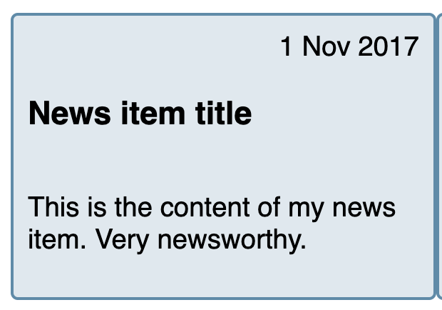

# Flex

> ✅ 외부 디스플레이 타입(inline, block, inline-block): 부모와 형제간의 박스  
> ✅ 내부 디스플레이 타입(flex, grid): 내부 자식 박스간의 배치

<br>

## Flex 박스를 1차원이라 하는 이유?

- 레이아웃을 다룰 때 한번에 하나의 차원(행 또는 열)만 다룬다.

<br>

## Flex를 써야할까 Grid를 써야할까?

레이아웃 기준

```Text
📓 1차원 배열: flex 먼저 고려해보자!
📓 2차원 배열: grid 먼저 고려해보자!
```

<br>

## flex 컨테이너에 적용하는 속성

- flex 컨테이너: flexbox가 놓여있는 영역
- flex 컨테이너를 생성하기 위해서는 `display: flex` 혹은 `inline-flex`로 지정한다.
- flex-container는 주축(axis)을 가진다. 기본적으로 왼쪽에서 오른쪽으로의 방향성을 갖는다.
- 주축의 시작점을 flex-start, 주축의 끝점을 flex-end로 부른다.

<br>

### 자주 사용되는 3가지 조합

```CSS
display: flex;
justify-content: center;
align-items: center;
```

### `justify-content`

- 주축을 기준으로 flex 아이템들의 정렬 방법을 설정한다.
- `space-around` 속성값: flex 아이템들이 각각 같은 크기의 양쪽 여백을 갖도록 한다.

### `align-items`

- 교차 축에서 **한 줄** 아이템들의 정렬 방법을 설정한다.
- `stretch` 속성값: 기본값, flex 컨테이너의 교차축을 기준으로 flex 아이템들이 컨테이너의 높이만큼을 차지한다.
- `baseline` 속성값: 텍스트 요소의 baseline에 맞춰 flex 아이템들이 정렬된다.

### `align-content`

- `flex-wrap: wrap`이 설정된 경우 교차 축을 기준으로 **두 줄 이상**의 flex 아이템들을 정렬한다.

### `flex-wrap`

- `nowrap`: 기본값, flex 아이템들이 flex 컨테이너의 크기에 맞춰 일정 비율만큼 줄어들어 한줄에 정렬되도록 한다.
- `wrap`: **flex 아이템들의 너비의 합이 flex 컨테이너의 너비보다 클 때**, 줄바꿈을 하여 다음 줄에 정렬될 수 있게 한다.

```CSS
.container {
  width: 300px;
  display: flex;
  flex-wrap: wrap;
  border: 5px solid dodgerblue;
}
.item {
  border: 5px solid black;
  width: 50px;
  height: 50px;
  padding: 20px;
  background-color: pink;
}
```

</img>

- `wrap-reverse`: `wrap`과의 차이는 교차 축의 cross-start와 cross-end가 반대가 된다.

### `flex-flow`

- `flex-direction`, `flex-wrap`의 단축 속성
- 속성값을 하나씩만 쓰면 각각 `flex-direction`, `flex-wrap`가 적용된다.
- 속성값을 2개 사용할 때는 `flex-flow: <flex-direction 속성값> <flex-wrap 속성값>`와 같이 사용한다.

<br>

## flex 아이템에 적용하는 속성

- flex 컨테이너의 상태에 따라 flex 아이템들의 레이아웃을 결정하는 속성이다.

<br>

### `flex-basis`

- flex 아이템들의 크기를 지정한다.
- 주축의 방향에 따라 값이 다른 곳에 지정된다.
- 내부 콘텐츠의 크기에 따른 유연한 크기를 갖는다.
- flex-basis가 적용되면 width, height는 무시된다.

### `flex-grow`

- `flex 컨테이너의 남은 사용 가능한 공간 중 속성값의 비율만큼을 할당받는다.
- `flex-grow: 1`: 모두 동일한 크기의 공간을 할당받는다.
- `flex-grow: 2`: 특정 flex 아이템만 해당 속성값을 가질 경우, 다른 flex 아이템보다 2배 큰 여백 공간을 할당받는다.

<br>

### `flex-basis`와 `flex-grow`

- flex 컨테이너 내 5개의 flex 아이템 크기를 40px로 지정했다.  
  </img>

```HTML
<div class="container">
  <div class="item">
    Lorem ipsum dolor sit amet consectetur adipisicing elit. Numquam maxime
  </div>
  <div class="item">
    Lorem ipsum dolor sit amet consectetur adipisicing elit. Numquam maxime
  </div>
  <div class="item">
    Lorem ipsum dolor sit amet consectetur adipisicing elit. Numquam maxime
  </div>
  <div class="item">
    Lorem ipsum dolor sit amet consectetur adipisicing elit. Numquam maxime
  </div>
  <div class="item">
    Lorem ipsum dolor sit amet consectetur adipisicing elit. Numquam maxime
  </div>
</div>
```

```CSS
.container {
  display: flex;
}
.item {
  flex-basis: 40px;
  background-color: aqua;
  border: 1px solid black;
}
```

- 이때, 첫 번째 flex 아이템에만 `flex-grow: 3`을 지정하고 나머지 flex 아이템에는 1을 지정하면 다음과 같이 된다.
- 첫번째 flex 아이템은 40px의 크기에 flex 컨테이너가 사용 가능한 공간을 3/7만큼을 할당받는다.
- 나머지 flex 아이템은 40p의 크기에 flex 컨테이너가 사용 가능한 공간의 1/7만큼을 할당받는 것을 확인할 수 있다.
  </img>

❗️ 따라서 flex-basis가 적용된 flex 아이템의 크기를 flex-grow로 flex 컨테이너의 여백을 가져와 크게 만들 수 있다.

<br>

### flex-shrink

- `flex-grow` 와 반대되는 개념이다.
- flex 아이템의 크기가 지정된 `flex-basis`값에서 얼마나 더 줄어들어도 되는지를 지정한다. 따라서 크기를 고정하거나 줄일 수 있다.
- 기본값은 1이다. 0을 적용하면 컨테이너의 크기가 줄어도 flex-basis로 설정한 넓이보다 작아지지 않는다.

<br>

### flex

- `flex` 속성을 사용하여 `flex-grow, flex-shrink, flex-basis` 속성의 값을 축약할 수 있다.

```css
flex: 2 300px; /* flex-grow:2; flex-shrink:1; flex-basis:300px; */
flex: 1 1 300px; /* flex-grow:1; flex-shrink:1; flex-basis:300px; */
flex: 1 0 100px; /* 너비는 100px보다 작아지지 않고, flex 컨테이너의 가용 공간을 동일한 크기로 할당받아 flex 아이템의 너비가 유동적으로 늘어난다 */
```

<br>

### align-self

- 부모의 align-items 속성을 덮어쓰고, 특정 flex 아이템에 개별적인 align-items 속성을 부여할 수 있다.
- 기본값: stretch

<br>

### order

- flex 아이템들이 보여지는 순서를 결정한다.

### order의 값은 순서가 아니다.

- 숫자는 크기에 따라서만 정렬된다. 숫자의 값이 크면 뒤로 간다. **순서가 아니다.**

### order는 언제 쓸까?

- 스크린 리더는 순서대로 읽어야 하지만 화면에 보여지는 것을 앞이나 뒤로 빼야할 때 (웹 접근성 측면)

[Ordering flex items - CSS: Cascading Style Sheets | MDN](https://developer.mozilla.org/en-US/docs/Web/CSS/CSS_Flexible_Box_Layout/Ordering_Flex_Items#use_cases_for_order)

</img>

- 스크린 리더에서는 제목, 날짜, 내용으로 읽어야 한다. 하지만 order 속성으로 위로 올려준것.
- 순수 Js로 검색 기능 만들었을 때(서버에서 가져오는 게 x), 서버와 통신하지 않고 가져와서 마크업 상에서 순위를 변경해줘야 할 때
