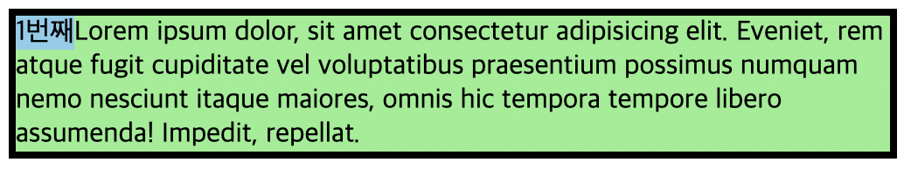

# float

## float 속성값

- **블록 레벨 요소를 정렬**하는 가장 기본적인 방법으로 사용된다.

> 🤔 float 속성의 유래?
>
> - 잡지와 같은 인쇄물에서 이미지 옆으로 텍스트를 둘러쌓은 페이지들을 자주 볼 수 있다.
> - float는 이처럼 이미지에 따라 흐르는 텍스트 흐름을 웹에서 구현하기 위해 생겨났다.

<br>

### left, right

- left: 요소를 왼쪽으로 정렬
- right: 요소를 오른쪽으로 정렬

<br>

### 부모 컨테이너 내에서 자식 요소에 float 속성을 추가하면?

- 블록 레벨 요소는 부모 요소의 가용 공간을 다 차지하여 한 줄씩 위치한다.
- 첫 번째 자식 요소에 `float: left`를 추가하면 콘텐츠의 크기만큼의 너비를 갖고 왼쪽 정렬이 된다.
- 두 번째 자식 요소는 첫 번째 자식 요소에 바로 붙게 된다.

```HTML
<div class="wrapper">
  <div class="one">1번째</div>
  <div class="two">Lorem</div>
</div>
```

```CSS
.wrapper {
    width: 500px;
    border: 4px solid;
  }
  .one {
    background-color: skyblue;
    float: left;
  }
  .two {
    background-color: lightgreen;
  }
```

</img>

- 컨테이너의 너비보다 float 적용된 요소들의 너비 합이 더 커지면 콘텐츠가 순차적으로 떨어진다.

</img>

<br>

### 인라인 요소에 float 속성을 적용하면 어떻게 될까?

- 인라인 요소에 float 속성을 적용하면 display 속성값이 자동으로 block으로 바뀐다.  
  예를 들어, 아래와 같은 img 태그와 a 태그가 있을 때, img와 a 태그는 모두 인라인 요소이므로 baseline을 기준으로 각각 위치해 있다.

```HTML
<div class="join">
  
  <a href="" class="link-join">회원가입</a>
</div>
```

</img>

이때, join 클래스명을 갖는 div 요소의 모든 자식 요소에 float 속성을 적용하면 자식 요소들은 `display: block` 으로 변환된다.

```CSS
.cont-login .join * {
  float: left;
}
```

</img>  
더 이상 img와 a 태그는 인라인 요소의 성질을 갖지 않아 베이스라인을 기준으로 배치되지 않고 정렬되는 모습을 확인할 수 있다.

> 📓 정렬도 해야하고, block 요소로 바꿔도 좋다면 적용해보자!

<br>

### 왜 부모 요소는 float 속성이 적용된 자식 요소들을 인지하지 못할까?

- 브라우저에는 화면에 요소들을 보여주는 여러 방법이 있다. 대표적으로 **normal flow, float, position**이 있다.
- 대부분의 요소(블록 레벨, 인라인 요소)는 normal flow에 따라 배치된다.
- 자식 요소에 모두 float 속성을 적용하면 일반 흐름에서 빠져 붕 띄워진 상태로 부모 요소가 인식을 못하게 된다.

normal flow에서 벗어난 자식 요소를 부모 요소가 인지하기 위해서는 Block-Formatting-Context(BFC)를 생성해야 한다. BFC는 float 속성이 적용된 자식 요소를 부모 요소가 인식하게 한다. 다음의 방법으로 BFC를 생성한다.

1. 부모 요소에 `overflow:visible` **제외**한 overflow 속성 추가
2. 부모 요소의 높이 값 직접 지정 ➡️ 부모 요소의 높이를 변경해줘야 할 일이 잦아 비효율적이다.
3. clear 속성 사용 ➡️ left, right, both 값이 있고, float이 사용된 요소가 정렬된 방향에 따라 사용할 수 있다. both는 left, right를 둘다 해제한다.
4. clear-fix

- `::after` 가상 요소 선택자로 해결하는 방법
- 부모 요소에 가상으로 마지막 자식 요소를 덧붙여 부모 요소가 자식 요소들을 알아보게 한다.
- `display; block` 대신 `display: table`을 사용하기도 한다.

```CSS
.wrap::after {
  content:'';
  display:block;
  clear:both;
}
```

> 📓 인라인 요소들은 float 속성이 적용된 요소를 알아본다.

[Block formatting context - Developer guides | MDN](https://developer.mozilla.org/en-US/docs/Web/Guide/CSS/Block_formatting_context)
