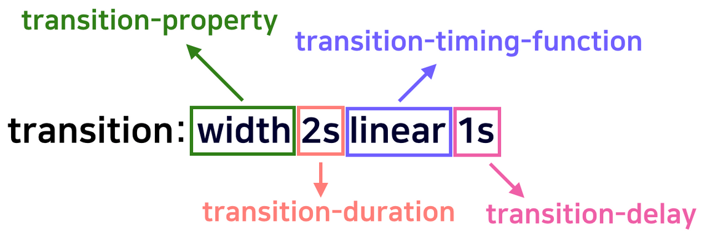

# CSS transition, transform

<br>

## transition의 속성들

### transition-delay

- transition이 일어날 때 얼마만큼 기다렸다가 실행할지를 결정한다.
- **음수 값**도 지정 가능하다.

<br>

### transition-duration

- transition이 일어나는 지속 시간을 설정한다.

<br>

### transition-property

- 어떤 속성에 transition 효과를 줄지 설정하는 것
- 속성값: `all`, `none`, `property`, `initial`, `inherit`

<br>

### transition-timing-function

- transition의 진행 속도를 설정한다.
- IE 버전 10부터 사용 가능
- `timing-function`의 값: `ease`, `linear`, `ease-in`, `ease-out`, `ease-in-out`, `step-start`, `step-end`, `steps(int, start|end)`, `cubic-bezier(n, n, n, n)`, `initial`, `inherit`

[cubic-bezier.com](https://cubic-bezier.com/#.17,.67,.83,.67)

<br>

### transition

- 위의 속성들을 `transition` 속성으로 한번에 적용할 수 있다.

</img>

### transition의 적용 대상?

- 모든 요소, `::before, ::after` 가상 요소 선택자

> 📓 성능 최적화
>
> - GPU는 기본 font-size가 있어도 font-size를 명시해주면 좀 더 빨리 동작한다.

<br>

## transform

- 요소의 여러 형태를 변형할 때 사용한다.

<br>

### scale() 함수

- 요소의 크기를 변환시킨다.
- `scale(1)`에서 **1=100%**를 의미한다. 따라서 1 이상의 값을 적용해야 크기가 변환된다.
- scale은 기본적으로 기준점이 중심에 있다. 따라서 가운데를 중심으로 커지는 효과가 나타난다.

<br>

### rotate() 함수

- 회전을 시킬 수 있다.
- 괄호 안에 들어가는 값은 각도이고, 입력값만큼 회전을 한다. 단위는 deg(degree)이다.

```css
.box:hover {
  transform: rotate(360deg);
  /* transform: rotate(1turn)과 같다. */
}
```

<br>

### translate() 함수

- 요소를 x, y 축을 **기준**으로 이동 시킨다.
- 괄호 안에 (x축, y축) 값을 넣는다.

```css
.box:hover {
  transform: translate(100px, 100px);
}
```

<br>

### skew() 함수

- skew: 외곡하다.
- 요소를 비틀거나 외곡을 주어 형태를 변형시킨다.
- 각도로 표시하고 단위는 deg이다.
-

```css
.box:hover {
  transform: skew(400deg);
}
```

<br>

### transform-origin 속성

- 기준점을 변경할 때 사용한다.

```css
.box {
  width: 100px;
  height: 100px;
  background: dodgerblue;
  transition: all 1s;
  transform-origin: left top;
}
.box:hover {
  transform: rotate(360deg);
}
```

- rotate시 기준점은 중심점이지만 `transform-origin:left top;` 을 통해 왼쪽를 기준으로 회전하게 된다.

<br>

> 📓 ❗️translate vs position 어떤 것을 써야 할까?
>
> 정적인 사이트에서 **요소의 위치를 단순 배치**하는것은 **position**을 사용해도 괜찮지만, 애니메이션이나 혹은 **동적으로 요소의 위치를 이동해야 하는 경우** **transform** 속성을 사용하는 것이 성능에 좋다.
