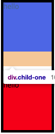
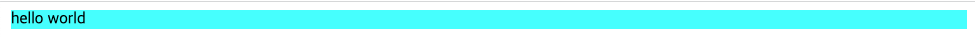

# 마진 병합 현상

> 마진 병합 현상은 일부러 의도한 CSS이다.  
> 대부분의 경우 문제로 여기지 않고, 해결하지 않아도 되는 부분이다.

 

## 마진 병합 현상의 종류

### 1. 형제 요소 간에 발생하는 마진 병합 현상

- 마진이 겹치는 부분의 margin 값 중 더 큰 margin 값이 적용된다.  
  </img>

### 2. 부모 요소와 자식 요소 간의 마진 병합 현상과 해결 방법

부모 요소에

1. overflow: hidden; 적용
2. display: inline-block 적용
3. 부모 요소에 border 값 적용. 단, 디자인적으로 border 적용해줘야 하는 경우 사용
4. display: flow-root; (IE 적용 x)

### 3. body와의 마진 병합 현상

- body 요소의 margin 속성을 초기화하지 않으면 마진 병합 현상이 발생할 수 있다.
  </img>
