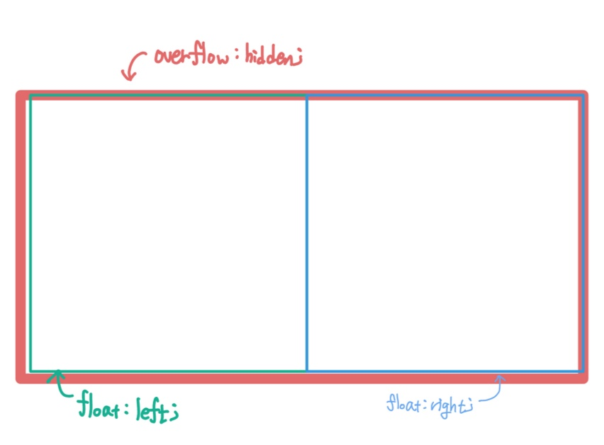

# OT & 일단 만들어보는 HTML과 CSS

> 22.08.29

<br>

## 성장하기 위해서는?

- 순서대로 공부할 때 함정에 빠지게 되는 것을 막기 위해 outcome을 먼저 그리고, 그에 필요한 기술을 더해라 (빌드업)
- 나의 뾰족한 무기를 만들자
- 여러번 실패하고, 주저없이 시도하는 사람이 되자
- 나를 실험하고 개선하고 있구나라고 생각하기(성공했다, 실패했다라고 생각x)
- 여러번 반복하기 ➡️ 익숙해지기
- 멘탈관리
- 어제 오늘 배운 것을 어떻게 더 잘 써먹을 수 있을까! 라고 생각하기
- ‘들어봤다 → 배웠다 → 해봤다 → 다르게 해봤다’ 로 도약하기
- 팀 프로젝트를 준비하기 위해서 어떻게 소통할지, 어떤 것을 공부해야 할지를 준비하기
- 추천받은 책: '구글 엔지니어는 이렇게 일한다'/ '함께 자라기: 애자일로 가는길'
  (필요한 부분을 발췌해 어떻게 적용할지를 생각해보는 것이 좋음)
- 피드백이 중요한게 아니라 ‘어떻게 피드백을 주고받는지'가 훨씬 중요하다. (**좋은 피드백의 기준**: 상대방이 기분좋게 움직이고, 임팩트가 있느냐!)

<br>

## 일단 만드는 HTML과 CSS

### 태그의 종류

- html 파일의 기본 구조

```html
<!DOCTYPE html>
<html>
  <head></head>
  <body></body>
</html>
```

<br>

### `<head>` 태그 안에 들어가는 것

- `<title>`: 크롬의 탭, 검색 엔진 등에서 웹 페이지 이름을 나타내는 태그

- 콘텐츠 표현을 위한 부수적인 것들이 들어감
- `<meta charset=”UTF-8”>`
- ❗️`<body>` 태그에는 화면에 나타낼 콘텐츠를 넣는다.

<br>

### CSS의 필요성

- `<footer>` 태그를 써도 p 태그랑 비교했을 때 변화가 없음
- html은 문서의 요소를 구분하고, 요소의 의미를 부여하는 역할
- `<p>`: paragraph, 일반적으로 모든 글을 `<p>` 태그로 묶는다.
- `<footer>` 태그: 화면 바닥에 쓰여지는 안내물
- html을 꾸며주는 것이 CSS
- CSS 파일을 따로 만들자
- `<link>` 태그: css와 html 파일을 연결하기 위한 태그
- `<link rel=”stylesheet” href=”파일이름.css”>`
- CSS를 이용하여 태그를 꾸미는 법

```CSS
태그 이름 { 태그에 적용할 CSS }
```

<br>

### 같은 태그를 다르게 CSS에 표현하기 - `class`

```html
<p class="big-font">큰 폰트 사이즈</p>
<p class="small-font">작은 폰트 사이즈 1</p>
<p class="small-font">작은 폰트 사이즈 2</p>
```

```css
p {
  font-size: 30px;
}

.big-font {
  font-size: 40px;
}

.small-font {
  font-size: 15px;
}
```

<br>

### `div` 박스

- division(영역)을 구분하는 태그
- div 박스를 한가운데 정렬하는 법
  `margin: 0 auto;`

<br>

### 박스에 그림자 넣기

`box-shadow: 가로위치 | 세로위치 | 흐릿함 정도 | 그림자 퍼지는 정도`

<br>

### 구글 폰트 쓰기

- 구글 폰트를 불러오기
  ```css
  @import url("https://fonts.googleapis.com/css?family=Montserrat:100,200,300,400,500,600,700,800&display=swap");
  ```
- 구글 폰트를 적용하기

```css
/* 문서 전체 적용시 * 태그를 사용한다 */
* {
  font-family: "Montserrat";
}
```

- `<section>` 은 `<div>`랑 완전 똑같고, `<div>`에 의미를 부여해 요소를 나누기 위한 태그로 제일 많이 쓰임

```html
<section>
  <div>
    <div>
      <article>content1</article>
      <article>content2</article>
    </div>
    <article>content3</article>
  </div>
  <article>content4</article>
</section>
```

<br>

### 로렘 입숨(lorem ipsum)

- 디자인을 보기 위한 아무 의미없는 텍스트
- `font-style`: 기울임 등의 폰트 스타일을 지정하는 태그

<br>

### float와 overflow

- `float`: 컨테이너가 일반 흐름에서 빠져나와 둥둥 떠다니며 좌우 정렬이 가능함.
- `overflow: hidden`: float가 적용된 자식 요소를 다 묶어주고, 그 다음에 오는 요소들이 float에 영향을 받지 않게 해준다.

</img><br/>
