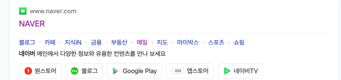

## Visual Studio Code 설정

- 코드 스니펫 설정 후 적용: `htmlko + tab`
- 아래의 emmet 작성 후 `tab`키

```html
<!-- div{hello}*10 -->
<div>hello</div>
<div>hello</div>
<div>hello</div>
<div>hello</div>
<div>hello</div>
<div>hello</div>
<div>hello</div>
<div>hello</div>
<div>hello</div>
<div>hello</div>
```

- 동시 수정 : `cmd + option + 방향키(상, 하)`,`option + Click`, `option+ Shift + Drag`, `Alt + Shift + i`
- `lorem + tab` : 아무의미 없는 lorem 문자 나옴
- 태그 안 내용에 또 태그를 달고 싶을 때
  - 태그 넣을 단어 `Drag` → `option + w` (**htmltagwrap** 익스텐션)

## emmet

[Cheat Sheet](https://docs.emmet.io/cheat-sheet/)

- 자동완성: 입력 후 tab

```html
h1 h1{hello} p{hello}*10 p>strong h1+h2+p h1#one h1.one #one .one
h1#one.two.three.four
<!-- 넘버링 $: 숫자를 순서대로 나열한다. -->
h$*6 h${hello}*6 div.container-$.row-$*6
<!-- 텍스트를 넣기 전에 글자의 자간, 골격 등을 미리 보는 것 -->
lorem lorem5 5개 단어 lorem*5 5문단 img:z p[a="value1" b="value2" c=1 d=value3]
a[href="https://www.naver.com"]
<!-- 테이블 행5, 열10 -->
table>(tr>td{hello}*10)*5 table>tr*5>td*10
table>(thead>tr>th{제목}*5)+(tbody>tr*10>td{내용}*5)+tfoot>td*6
<!-- table에는 thead tbody tfoot이 꼭 들어가야 script 적용시 문제가 없다! -->
```

## 도메인, IP, Port

### 도메인, URL

- 웹 페이지의 이름, 웹 페이지를 찾기 위한 주소
- ex) www.naver.com

### IP

- 고유한 주소
- ex) 105.209.222.141

### Port

- 어떤 주소를 갖는 곳의 문과 같다.
- Port에 따라 보여지는 화면이 다르고, 작동되는 구성이 다르다.

<br>

## HTML Living Standard

> 📓 2019년 부터는 HTML5대신 HTML Living Standard로 불린다.

- HTML: 마크업 언어

  ```
  마크업 언어(Markup language)란?
  태그(</>)와 같은 기호를 이용해서 문서를 작성하도록 도와주는 언어

  마크다운(Markdown)?
  앞에만 기호를 쓰는것 (ex. 깃허브 리드미, 노션..)
  ```

- meta 태그로 **문서의 정보**를 나타낼 수 있다.
  </img><br/>
