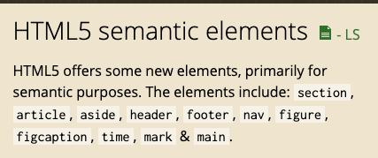

# Sections & Grouping Contents

> 22.08.31

<br>

## 프론트엔드 개발자란?

- 프론트엔드: HTML, CSS, JS, 크로스 브라우징, 웹표준, 접근성, FE 프레임워크(Angular, React, Vue)
  - 크로스 브라우징: 다양한 브라우저를 모두 고려해 개발(크롬, 파이어폭스, 엣지, 삼성 인터넷 등..)
- 이외에도 프론트엔드 개발자가 고려해야 하는 것
  - 성능측정(애니메이션 퍼포먼스, 서버와의 통신시간, 지연시간)
  - 웹 렌더링(브라우저 작동 방식 파악해 렌더링 성능 최적화)
  - 웹 접근성(스크린 리더, 명도, 채도 등을 이용해 장애인 분들의 사용성 고려 & 웹 에이전트 고려)
  - 웹 표준 준수
  - 검색엔진 최적화(SEO)
  - 레거시 브라우저 대응(옛 브라우저들 ex)IE, Android, IOS 등..)
  - R&D (미래 기술에 대한 대비)
  - 디자이너, 기획자 납득시키기

<br>

## Semantic Tag

- 웹에 존재하는 많은 문서들의 HTML의 구조 파악에 도움을 주고자 HTML5에 등장했다.  
  </img>
- 위의 HTML5에 나온 시멘틱 태그들이 몇몇 브라우저에서 적용되지 않기 때문에 회의 시 크로스 브라우징을 할 범위를 정해 대응을 한다.<br>
  [Can I use... Support tables for HTML5, CSS3, etc](https://caniuse.com/)

<br>

## Sections

### `<section>`

- 현재 사이트와 연관있는 콘텐츠의 구획을 나눌 때 사용

<br>

### `<article>`

- 요소의 콘텐츠가 독립적일때 사용
- ex. 위젯

<br>

### `<header>`

<br>

### `<main>`

- 페이지의 대표적인 내용을 감싸는 태그
- HTML을 시멘틱하게 작성해야 하는이유? 웹 세상에 존재하는 수많은 문서를 정리하기 위해서
- 사람은 내용을 보고 어떤 것인지 알 수 있지만, 브라우저는 그 의미를 해석하지 못하고 태그를 통해 의미를 판단할 수 있기에 시멘틱한 태그로 브라우저에게 친절하게 알려줘야 한다.

<br>

### `<h1> ~ <h6>` (Heading 태그)

- heading 태그는 **중요도**에 따라 사용되는 것이다!<br>(단순히 글자를 크게하거나 굵게하기 위해 사용하는 것이 아님)
- h1 요소는 페이지당 한 번만 사용하는 것이 좋다.
- 페이지의 가장 큰 범위에서 h1을 쓰면 다음으로 큰 카테고리(섹션)에는 차례대로 h2를 쓰는 것이 브라우저에 혼란을 주지 않는다.
- 사용자에게 페이지의 계층구조를 쉽게 파악할 수 있도록 하므로 heading 레벨을 갑자기 몇 단계 뛰어넘는 것은 지양해야 한다.

<br>

### `<aside>`

- 각주 혹은 광고 영역에 사용됨

<br>

### `<footer>`

- footer 요소가 속한 가장 가까운 구획의 작성자 정보, 저작권, 관련된 링크 등의 내용을 담는 구획 요소

<br>

### `<address>`

- 문서 전체의 연락처 정보(전화번호, 메일 주소, 우편 주소 등)에 사용
- 보통 `<footer>`안에 많이 사용

<br>

```Text
❗️ 태그를 목적에 맞게 사용하자!
```

## Grouping Contents

### 목록을 정의할 때 사용하는 태그

> 아이템 개수가 3개 이상일 경우에 목록으로 표현하는 것이 좋다.

<br>

### `<ol>, <ul>, <li>`

<br>

### `<dl>, <dt>, <dd>`

- 사전처럼 어떠한 것을 정의할 때 쓰이는 목록
- `<dl>`: 정의형 목록
- `<dt>`: 정의할 용어
- `<dd>`: 정의할 용어에 대한 설명
- 예외적으로 `<dl>`안에 직계 자식으로 `<div>`를 쓸 수 있다.

<br>

### `<div>`

- `<article>, <section>, <header>, <nav>` 모두 `<div>`로 대신 사용할 수 있으나 보다 적합한 요소를 찾은 후 대용할 태그가 없을 경우 사용하자.

<br>

### `<figure>`, `<figcaption>`

- 이미지와 캡션을 함께 보여줄 때 사용
- `<figure>`의 자식 요소로 `<figcaption>`를 넣어 캡션을 덧붙인다.

<br>

### `<p>`

- 하나의 완결된 단락을 나타내는 태그
- `<p>` 태그 안에 자식으로 `<p>`를 또 사용하지 않는다.
- 줄바꿈의 용도로 사용하지 않는다.
- ❗️ 줄바꿈을 할때는 `<br>`을 사용
- ❗️ 줄을 긋거나 단락을 구분할 때 사용하는 `<hr>` 태그도 안에 사용해서는 안된다.

<br>

### `<pre>`

- 코드를 작성한 그대로 나타낼 때 사용

<br>

### `<blockquote>` 와 `<q>`(quote)

- `<blockquote>`: 인용 블록
- `<q>`: 인용구

<br>

### `<main>`

- 문서의 주요 콘텐츠
- 비교적 최근에 등장한 요소로 IE에서는 지원하지 않으므로 주의가 필요하다.

<br>

### Entity

- 예약어를 원래의 목적대로 사용하기 위해 별도로 만든 문자 셋
- HTML의 예약어를 코드에서 그대로 사용하면 원래의 목적과 다르게 예약어로 해석된다.

- 가장 많이 사용되는 예약어

1. &

```
&amp;
```

2. <

```
&lt;
```

3. &gt;

```
&gt;
```

4. "

```
&quot;
```

<br>

## 느낀점

이렇게 많은 시멘틱 태그들이 있는데도 불구하고 지금까지 `<div>`를 남발하고 있었다는 것을 깨달았다. 네이버 페이지의 구획을 직접 나눠보며 시멘틱 태그의 용도에 맞게 태그를 부여하기 위해 각 요소의 콘텐츠, 동작 등 다양한 것을 고려해야 겠다고 생각했다. 다양한 페이지의 HTML 구조를 생각해보고 어떤 태그를 넣는게 좋을까를 고민해보는 연습을 통해 시멘틱 태그에 익숙해져야겠다.
