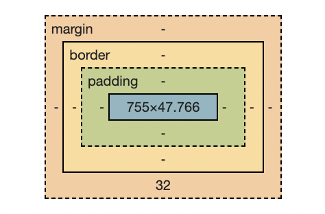

# ALLDAY CSS

with 이종찬 강사님

> 22.09.02

<br>

## 용어 정리

### HTML

```HTML
  <p>고양이</p>
```

- 태그 (Tag): `<div> </div> <p> </p>`

- 요소 (Element): `<p>고양이</p>`

<br>

### CSS

Type Selector (유형 선택자)

- 태그의 타입을 기반으로 요소를 선택한다.
- 선택자 타입을 갖는 HTML내의 모든 요소를 선택한다.

Property(속성) & Value(값)

- 속성 = `background-color`
- 값 = `white`

```CSS
div { /* div는 유형 선택자(type selector): 태그의 타입을 기반으로 선택 */
	background-color: orange;
	/* property(속성): value(값); */
}
```

`*`: 전체 선택자(universal selector)

<br>

## Block 요소에서의 `width: auto`, `height: auto`

> CSS의 프로퍼티마다 초기 값(initial value)이 지정되어 있다.

```css
div {
  /* initial value*/
  width: auto; /* 부모 기준, 부모 요소로부터 주어진 사용 가능한 너비만큼 차지 */
  height: auto; /* 자식 기준, 컨텐츠 크기만큼의 자동 크기를 갖는다. 유지보수에 적합 */
}
```

- `auto` = `initial`
- body 요소에 기본으로 적용된 margin 8px : 브라우저에서 제공한 스타일(user agent stylesheet)
- width, height 지정되고 padding 적용되면 전체 크기가 커진다.
- 100%와 차이: 단순히 계산한 픽셀값

<br>

> 📓 height: auto가 유지보수에 적합한 경우는 언제일까?
>
> 콘텐츠의 크기에 따라 height가 자동으로 늘어나거나 줄어들어야 할 때이다.  
> `height: auto`는 높이를 컨텐츠 크기만큼으로 자동 조절한다.

> 📓 auto는 초기 값인데 명시적으로 값을 지정해주는 경우는 언제일까?
>
> width 속성값을 px로 지정하고, 미디어 쿼리에 따라 auto로 바꾸고 싶을때 auto를 명시적으로 지정한다.

<br>

## 박스 모델

하나의 박스 모델은 다음의 4가지 영역으로 이루어져 있다.

- content
- padding
- border
- margin  
  </img>
- `padding`이나 `border`가 들어가면 요소의 크기가 커진다. 이때, `box-sizing: border-box;`를 적용하면 지정한 `width, height` 속성값의 크기가 된다.

```css
div {
  background-color: orange;
  width: 200px;
  height: 200px;
  padding: 40px;
  /* box-sizing: content-box; -> initial value */
}

div {
  background-color: orange;
  width: 200px;
  height: 200px;
  padding: 40px;
  box-sizing: border-box;
}
```

<br>

## Block 요소

- Block 요소는 기본적으로 부모 요소가 제공하는 너비 전체를 차지한다.
- width와 height 속성값을 부모 요소의 너비보다 작게 지정하면 해당 요소가 사용 가능한 남는 공간이 생긴다.
  </img>

<br>

### `margin: 0 auto`

- Block 요소의 사용 가능한 공간(남은 공간)을 자동(auto)으로 여백으로 가져간다.
- Block-level에서 위, 아래 공간은 다음 콘텐츠의 공간이다. 따라서 `margin: auto`를 적용해도 위, 아래는 margin이 0으로 적용된다.
- **Block 요소** 가운데 정렬
- width 속성값이 고정적으로 지정되고, 사용 가능한 공간이 남았을 때 적용된다.

```css
div {
  width: 200px;
  margin: 0 auto;
}
```

크롬 브라우저가 기본으로 제공하는 스타일(user agent stylesheet)

[blink/renderer/core/html/resources/html.css - chromium/src/third_party - Git at Google](https://chromium.googlesource.com/chromium/src/third_party/+/master/blink/renderer/core/html/resources/html.css)

파이어폭스

[html.css - mozsearch](https://searchfox.org/mozilla-central/source/layout/style/res/html.css)

<br>

## HTML과 CSS를 사용하여 웹 페이지를 만들 때 작업 순서

> 시멘틱 태그보다 CSS에 초점된 수업으로 시멘틱 언어를 사용하지 않음

### 0. 몇 개의 덩어리로 이루어져 있는지 파악하기

- 그림을 그릴때도 눈코입을 먼저 그리기 보다 전체적인 틀에서 세부적으로 들어가야 하듯, 큰 틀을 파악한다.
- 처음에 틀을 잡는게 어렵다면 최소한의 마크업 언어로 구조화해라.

<br>

### 1. 최소한의 마크업으로 레이아웃을 하고, 추가를 해라! (한번에 너무 세세하게 레이아웃 하지 말것)

```html
<!DOCTYPE html>
<html>
  <head>
    <meta charset="UTF-8" />
    <title>PROFILE</title>
    <link rel="stylesheet" href="style.css" />
  </head>
  <body>
    <div>
      <div>Header</div>
      <div>Contents</div>
      <div>Footer</div>
    </div>
  </body>
</html>
```

<br>

### 2. 각 구조를 시각적으로 파악하기 위한 지표 추가 - `class` 사용

</img>

> 📓 같은 태그를 갖지만 각각의 요소에 다른 스타일을 지정하려면 어떻게 해야 될까?
>
> 요소에 **`class`를 지정**하고, Class 선택자를 사용해 class에 기반해 요소를 선택한다.

```html
<!DOCTYPE html>
<html>
  <head>
    <meta charset="UTF-8" />
    <title>PROFILE</title>
    <link rel="stylesheet" href="style.css" />
  </head>
  <body>
    <div class="wrapper">
      <div class="header">Header</div>
      <div class="contents">Contents</div>
      <div class="footer">Footer</div>
    </div>
  </body>
</html>
```

```css
.wrapper {
  background-color: #ddd;
  width: 800px;
  margin: auto;
}

.header {
  background-image: url(images/cover05.png);
}

.footer {
  background-color: #999;
}
```

<br>

### 4. 각 섹션 내의 세부적인 구조화

> 📓 여러 요소를 한번에 묶는 div의 클래스명은 뭐라고 하는게 좋을까?
>
> 클래스명을 container 또는 wrapper로 작성한다.

```html
<!DOCTYPE html>
<html>
  <head>
    <meta charset="UTF-8" />
    <title>PROFILE</title>
    <link rel="stylesheet" href="style.css" />
  </head>
  <body>
    <div class="wrapper">
      <div class="header">
        
        <h1>JANE DOE</h1>
        <p>FRONT-END DESIGNER</p>
      </div>
      <div class="contents">Contents</div>
      <div class="footer">Footer</div>
    </div>
  </body>
</html>
```

<br>

### 5. 구조화(HTML)한 후 의도하고자 하는 레이아웃 완성(CSS)

- `text-align`: block 요소 내의 가로 정렬을 설정한다.
- inline 요소: text/ image 등, base line 위에 배치된다.
- inline 요소는 **부모 요소(블록 요소)가 설정한** `text-align`에 영향을 받는다.
- `h1, p`에 배경색을 넣어 레이아웃을 살펴보자.

```html
<div class="header">
  
  <h1>JANE DOE</h1>
  <p>FRONT-END DESIGNER</p>
</div>
```

```css
.header {
  text-align: center;
  background-image: url(images/cover05.png);
}
```

> 📓 `margin: 0 auto` vs `text-align: center`
>
> `margin: 0 auto` ➡️ block 요소 자체가 가운데 정렬  
> `text-align: center` ➡️ 부모 요소(block 요소)에 해당 속성을 지정한다. 부모 요소(block 요소)안의 inline 요소들이 영향을 받아 가운데 정렬

</img>

- `h1`과 `p`는 텍스트를 다루는 태그지만 **block 요소**다. h1의 컨테이너는 block 레벨 요소지만 그 안의 텍스트는 inline 레벨 요소이다. 배경색을 적용해보면 부모 요소의 너비만큼 칠해지는 것을 확인할 수 있다.
- `h1`과 `p` 태그 안에 작성된 텍스트와 `img`는 인라인 요소이고, 부모 요소의 `text-align`의 영향을 받는다.
- 부모 요소 `<div class="header">`에 `text-align: center;`를 적용하면 자식 요소인 `img, h1, p`가 가운데 정렬이 된다.

<br>

### 상속

> 상속되는 프로퍼티(속성)이 존재한다.

- 부모에게 지정한 값이 자식에게 그대로 적용되는 것
- 속성을 덮어쓰면 부모의 속성이 상속되지 않는다.

</img>

<br>

### inherit

- inherit 키워드를 사용한 CSS 속성은 부모 요소로부터 속성값을 상속받아 사용할 수 있다.

```css
h1 {
  font-size: inherit;
}
```

- img 태그를 갖는 모든 요소에 css가 적용된다.

```css
img {
  border-radius: 50%;
  border: 5px solid #fff;
}
```

- Descendant Selector

```css
/* descendant combinator는 .header와 img 사이의 한칸을 의미한다. */
.header img {
  border-radius: 50%;
  border: 5px solid #fff;
}
```

- child selector

```css
.header > img {
  border-radius: 50%;
  border: 5px solid #fff;
}
```

<br>

### `class`와 `id`의 차이

- `class`: 여러 요소에 클래스에 다중으로 쓰이는 것이 용이함. 별칭

- `id`: identity 정확한 이름을 지정할 때, 확장성이 떨어진다.

➡️ 시각적인 요소들을 다룰때 `class`를 사용하는 것이 좋다.

<br>

### 마크업 개행

</img>

- 코드 작성시 `Enter`를 치는 행위가 개행에 영향을 미친다.
- 띄어쓰기의 크기는 **font size**에 따라 유동적으로 변한다.

> HTML은 디자인이 목적이 아닌 시멘틱 마크업을 통한 웹 페이지의 구조를 만들기 위함이다.
> 시각적인 어떠한 것에 영향을 주는 작업을 하는 것은 HTML의 마크업 목적에 어긋난다. ➡️ CSS로 해결하자!

```css
<div class="footer">
	<a class="link" href="">GitHub</a>
	<a class="link" href="">Facebook</a>
  <a class="link" href="">Contact</a>
</div>
```

<br>

### inline 요소는 width, height라는 개념이 존재하지 않는다.

- inline 요소는 margin을 지정 시 좌우만 적용된다.
- padding은 상하좌우 적용되긴 하는데 좌우는 공간을 차지하지만 상하는 실질적으로 공간을 차지하지 못한다.

<br>

### inline block

- inline의 세상에 놓인 block
- 콘텐츠의 크기만큼의 width 값을 갖는다.
- fit-content를 쓰기 어려울 때 많이 사용함

<br>

### CSS 코드를 유지보수하기

아래와 같이 클래스명은 모두 다르지만 속성이 많이 겹치면 유지보수에 좋지 않다.

```css
.link1 {
  /* 같은 속성값 적용하는 코드 */
  background-color: red;
}
.link2 {
  /* 같은 속성값 적용하는 코드 */
  background-color: orange;
}
.link3 {
  /* 같은 속성값 적용하는 코드*/
  background-color: yellow;
}
```

- 한 요소에 클래스를 여러 개 추가할 수 있다.
- 각 클래스에 적용한 CSS 스타일이 한 요소를 가리켜 적용된다.

```html
<div class="footer">
  <a class="link github" href="">GitHub</a>
  <a class="link facebook" href="">Facebook</a>
  <a class="link contact" href="">Contact</a>
</div>
```

```css
/* link 클래스를 갖는 요소들에 적용되는 공통 스타일 */
.link {
  padding: 10px 20px;
  display: inline-block;
  border-radius: 40px;
  border: 4px solid;
  color: #ccc;
}

/* 각각의 클래스명을 갖는 요소들에 적용되는 개별 스타일 */
.link.github {
  color: black;
}

.link.facebook {
  color: dodgerblue;
}

.link.contact {
  color: violet;
}
```

<br>

### CSS의 작동 원리와 선택자 우선 순위

> Cascading Style Sheet!!!

- CSS의 작동원리는 한 요소에 동일한 속성이 적용될 때 마지막에 작성된 것이 우선순위가 더 높다.
- 작성 순서가 중요하다.

```html
<div class="section skill">Skills</div>
```

```css
.section {
  backgruond-color: white;
}

.skill {
  background-color: red;
}
```

- 그렇다고 항상 마지막에 작성된 것이 우선순위가 높은 것은 아니다.
  - 구체적일수록 우선순위가 높다.
  - 브라우저는 구체적일 수록 더 가치있다고 판단한다.
  - 브라우저는 보라색을 적용한다. (ex. 셀렉터 사용)

```html
<h1 class="wow">Do My Best</h1>
```

```css
.wow {
	background-color: purple;
}
h1 {
	background-color: orange;
}
h1 {
	background-color: blue;
}

-> 보라색 적용
```

```css
.wow {
	background-color: purple;
}
h1.wow {
	background-color: orange;
}
h1 {
	background-color: blue;
}

-> 주황색 적용
```

</img>
