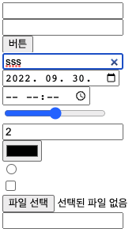

# Forms

> 22.09.07

<br>

## `<form>`

### Form 동작 방식

1. 웹 페이지 내의 form에 데이터를 입력한다.
2. 웹 페이지 내의 어떤 액션(ex. submit)이 발생하면 입력받은 데이터를 웹 서버로 보낸다.
3. 웹 서버는 데이터를 처리하기 위해 App 서버를 호출한다.
4. 필요에 따라 App 서버는 DB로 데이터를 전송하고, DB는 CRUD 작업을 진행한다.
5. 데이터 처리가 끝나면 처리 결과를 App 서버로 전달하고, App 서버는 다시 웹 서버로 보낸다. 웹 서버는 브라우저에게 최종적으로 결과를 보내고, 브라우저는 그에 따른 결과를 나타낸다.  
   </img>

<br>

### `<form>` 기본 속성

```html
<form action="012.html">
  <input type="text" name="id" />
  <input type="password" name="password" />
  <button type="submit">로그인</button>
</form>
```

</img>  
URL 내에 사용자가 입력한 아이디와 패스워드가 나타난다.

<br>

**action**

- 입력 받은 값을 처리할 페이지 주소, 서버 상의 script 파일(\*Form Handler)의 주소

**method**

- form의 데이터를 전송할 방법을 정의한다. 속성값은 GET과 POST이다.
- 기본값은 GET이다. GET으로 데이터를 전송하면 ? 뒤에 쿼리 스트링으로 입력한 데이터가 나타난다.
- name 속성의 값이 쿼리 스트링의 key가 되고, 사용자가 입력한 값이 value가 된다.

<br>

> **GET**: URL로 데이터를 전달할 때 사용, URL에 데이터가 드러난다.(file 같은 큰 파일은 GET으로 전송하지 않는다. id, pw같은 민감 데이터 x)
>
> **POST**: 패킷 안에 body로 데이터를 넣어 전달할 때 사용, GET으로 URL로 데이터를 노출시켜 전달하면 안되는 경우 (민감 데이터 o, 큰 데이터)
>
> POST로 데이터를 불러오는 경우? 관공서처럼 민감한 데이터 다룰 때, 보안 때문에 감싸서 보내는 것임
>
> → 둘다 데이터를 보낼 때, 데이터를 불러올 때도 사용한다!!
> ❗️ GET은 데이터를 불러오기, POST는 데이터를 보내기라고 무조건적으로 생각하지 않는다.

<br>

## `<input>`

### `<input>` 타입

```html
<form action="012.html" method="POST">
  <input type="text" name="id" /><br />
  <input type="password" name="password" /><br />
  <input type="button" value="버튼" /><br />
  <input type="search" /><br />
  <input type="date" /><br />
  <input type="time" /><br />
  <input type="range" /><br />
  <input type="number" /><br />
  <input type="color" /><br />
  <input type="radio" /><br />
  <!-- 택 1 -->
  <input type="checkbox" /><br />
  <!-- 다중 선택 -->
  <input type="file" /><br />
  <input type="email" /><br />
  <!-- @가 들어가도록 따로 유효성 검증하는 것이 좋음 -->
</form>
```

</img>

<br>

### `<input>` 속성

```html
<form action="">
  <!-- 읽기 전용, 회원 가입 할때, 주민등록번호 입력 받으면 성별이 들어가는 경우 -->
  <input type="text" name="성별" value="남" readonly />
  <input type="text" name="아이디" />
  <input type="text" name="test" maxlength="10" minlength="6" />
  <button type="submit">회원가입</button>
</form>
```

**readonly**

</img>

- 개발자 도구에서 readonly를 지워 데이터를 바꿀 수 있다. 따라서, 보낼 데이터와 보낸 데이터에 대한 유효성 검증이 필수다.
- 프론트에서는 서버로 보내도 괜찮은지에 대한 유효성 검증 코드 작성 및 난독화가 필요하다.
- 서버에서는 받은 데이터의 유효성을 검증해야 한다.

**maxLength, minLength**

- minLength보다 작은 텍스트 수가 입력된 채 submit 되는 것을 막는다.
- maxLength 보다 많은 텍스트 수가 입력되지 않도록 한다.

**required**

- 필수 태그로 지정한다.
- 필수 태그에 입력값 없이 submit 되지 못하도록 한다.

**placeholder**

- 입력값에 대한 힌트 텍스트를 준다.

**autofocus**
웹 페이지가 로딩 되면 이 속성을 지정한 태그로 포커스가 바뀐다.

**pattern**

- 정규표현식을 사용해 특정 범위 내의 유효한 값을 입력 받을 때 사용한다.

<br>

### `<fieldset>`

- 폼내의 자식 요소들을 그룹화(섹션화)할 때 사용

```html
<form action="">
  <fieldset>
    <legend>개인정보</legend>
    <label for="myName">이름</label>
    <input type="text" name="name" id="myName" />
    <label for="myTel">전화번호</label>
    <input type="tel" name="tel" id="myTel" />
    <label for="myEmail">이메일</label>
    <input type="email" name="email" id="myEmail" />
  </fieldset>
  <fieldset>
    <legend>개인정보 제공 동의</legend>
    <label for="checkAgree">개인정보 제공에 동의하십니까?</label>
    <input type="checkbox" name="agree" id="checkAgree" />
  </fieldset>
</form>
```

</img>

<br>

### `<legend>`

- `<fieldset>` 태그 바로 뒤에 위치하여 `<fieldset>` 의 첫 번째 자식 요소로 사용한다.
- 폼 그룹의 목적을 나타내는 제목을 의미한다.

<br>

## `<button>`

- 버튼을 클릭했을 때의 동작을 추가할 수 있다.
- 요소 안에 자식 요소 사용 가능

<br>

### `<button>` 타입

- `submit`: 버튼을 누르면 서버로 데이터를 제출. 버튼 타입의 기본값, 유효하지 않은 값일 때도 사용
- `reset`: `<input type="reset">`처럼, form의 모든 값을 초기화한다.
- `button`: 클릭 가능한 버튼. 사용자가 기능을 부여하기 전까지는 별 다른 작동을 하지 않는다.

<br>

### `<input>` vs `<button>` 무엇을 써야할까?

- `<button>` 요소는 `[<input>](https://developer.mozilla.org/ko/docs/Web/HTML/Element/Input)` 요소보다 스타일을 적용하기 훨씬 수월하다.
- `<input>`은 닫는 태그가 없기 때문에 `value` 특성에 텍스트 값 밖에 지정할 수 없다.
- `<button>`은 내부에 여러가지 자식 컨텐츠를 추가할 수 있고 `::after`와 `::before` 와 같은 가상 요소를 사용하는 것도 가능하다. 따라서 스타일 적용에 용이하다.

<br>

### `<datalist>`

- `<select>`와 `<input>`이 섞인 것
- 기본적인 옵션을 제공하면서 옵션에 선택하고 싶은 값이 없는 경우에 원하는 값을 입력 가능하게 하여 편의성을 제공한다.
- `<input>` 의 `list` 속성을 이용해 `<datalist>` 요소의 `id` 속성과 연결하여 사용합니다.

```html
<label for="solasystem">원하는 행성을 선택하세요 : </label>
<input type="text" id="solasystem" list="planets" name="planets" />
<datalist id="planets">
  <option value="수성">수성</option>
  <option value="금성">금성</option>
  <option value="지구">지구</option>
  <option value="화성">화성</option>
</datalist>
```

<br>

### `type=”hidden”` 사용되는 경우는 언제일까?

```html
<body>
  <form action="" method="">
    <input type="text" name="이름" value="홍길동" />
    <input type="hidden" name="나이" value="10" />
    <button type="submit">제출</button> <!-- example.html?이름=홍길동&나이=10
  </form>
</body>
```

- form에 제출되는 데이터를 JavaScript로 수정하는 일은 가능하면 하지 않는 것이 좋다. input으로 해결할 수 있다.
- form에 없는 데이터를 추가해 제출하고 싶을 때 input을 하나 더 만들고 type=”hidden”과 value값을 추가한다. 제출하면 입력한 값과 hidden의 value 값이 함께 제출된다.
- 따라서 input을 추가하기 위해 JavaScript로 input 태그를 동적으로 추가할 필요가 없다.
