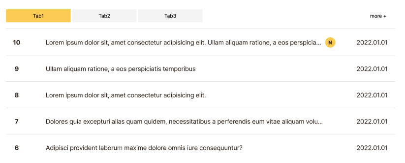

# Text-level semantics & Embedded content

> 22.09.06

<br>

## Text-level semantics

### 특징

- 요소안의 콘텐츠의 크기만큼만 영역 점유
- 자식으로 sections, grouping contents를 배치할 수 없다.
  ```html
  <span>
    <div></div>
  </span>
  ```
- HTML은 공백을 기준으로 문자인지 단어인지 구분한다.

  ```html
  <p>
    ddddfk
    <!--공백을 기준으로 이것을 단어로 구분한다.-->
  </p>
  ```

- **한글과 영어의 word-break 기본 속성값이 다르다.**

<br>

### `<br>`, `<wbr>`

- 내용에서 줄바꿈을 원하는 곳에 `<br>` 태그를 삽입하면 줄바꿈이 된다.
- 닫는 태그 x
- `<wbr>` 태그는 텍스트 박스에서 한 줄로 모두 표시가 안될 때 줄바꿈 규칙을 무시하고, 줄바꿈이 일어나게 한다.

<br>

### `<a href="경로">`

- HTML의 핵심적인 요소, 하이퍼 텍스트(Hypher Text)
- 링크를 만들 때 사용한다.
- **경로를 지정**할 수 있다. JavaScript로 경로를 지정하는 것은 웹 접근성에 위배되므로 사용하지 않는 것이 좋다.
- Text-level Semantics 중 `<a>`만 예외적으로 sections, grouping content 요소를 자식으로 사용 가능하다.
- 사용자와 인터렉션 가능한 요소(`<a>, <button>`)을 자식으로 두지 않는다.

```html
<!-- a 안에 a를 두면 브라우저가 해석 후 바깥으로 뺀다. -->
<!-- 인터렉션 가능한 요소인 button도 a 요소의 자식으로 두지 않는다. -->
<a href="">
  <a href=""></a>
  <button></button>
</a>
```

<br>

### `<a>` 태그 속성

- `target=”_blank”`: 링크의 주소를 새 창에서 열고 싶을 때 사용

```html
<a href="https://www.naver.com" target="_blank">click</a>
```

- 해시 링크: 페이지 내부에서 **특정 id를 가진 요소**로 이동하고 싶을 때 사용

```html
<!-- three라는 id를 가진 요소로 이동하게 해준다. -->
<a href="#three">click</a>
<!-- 해시 링크 -->
```

참고) `scroll-behavior`: 페이지 내부 이동 시 부드러운 스크롤링을 위한 CSS 속성

[scroll-behavior - CSS: Cascading Style Sheets | MDN](https://developer.mozilla.org/en-US/docs/Web/CSS/scroll-behavior)

- `download`: 파일을 다운로드 할 수 있게 해준다.

```html
<a href="./index.html" download>click</a>
<!-- 파일의 이름 자체가 다운로드 받을 파일의 이름이 된다 -->
<a href="./hello.hwp" download="a.hwp">hwp download click</a>
<!-- 다운로드 받을 파일의 이름을 지정 -->
```

> 💡 Internet Explorer 는 download 속성을 지원하지 않는다

- 모바일 웹을 위한 전화걸기와 이메일 보내기

```html
<a href="tel:+82027777777">(02)777-7777</a> /
<a href="mailto:hello@gmail.com">hello@gmail.com</a>
```

<br>

### `<b>, <strong>`

- `<b>`: 굵은 글꼴 표현을 위해 사용, 의미가 없다(= 시멘틱하지 않다) ➡️  **더 이상 사용하지 않는 요소❗️**(레거시 코드)
- `<strong>`: 굵은 글꼴에 **중요도**를 더해 **강조**할 때 사용 (강한 강조), heading 태그를 사용하기가 애매할 경우 `<strong>` 태그를 이용하여 제목을 쓰기도 한다.

<br>

### `<i>, <em>`

- `<i>`: 기울임 글꼴을 나타낸다.
- `<em>`: 기울임 글꼴 + **강조**

> 📓 HTML5에서 `<i>` 사용 용도
>
> - 주위의 내용과 구분해야 하는 부분을 표현
>
> 1. 전문 용어, 문단에서 주 언어와 다른 언어로 표현된 부분(주 언어가 한글이지만 영어로 표기할 경우)
> 2. 소설의 등장인물의 생각이 표기되어 있는 부분

<br>

### `<dfn>`

- 현재 문맥에서 정의하고 있는 용어
- `<dfn>`에서 가장 가까운 `<p>`, `<dt>/<dd>` 쌍, `<section>` 부모 요소를 `<dfn>` 정의에 대한 설명으로 간주한다.
- `dl, dt, dd`에서 목록이 아닐 때
- 문서에서 최초로 나타났을 때 사용한다.

```html
<dl>
  <dt>WWW</dt>
  <dd>
    <dfn>WWW</dfn>는 인터넷에 연결된 컴퓨터를 통해 사람들이 정보를 공유할 수
    있는 전 세계적인 정보 공간을 말한다. - 위키백과
  </dd>
</dl>
```

<br>

### `<abbr>`

- 준말, 약자를 나타낼 때 사용
- 보통은 혼자 쓰이고, `<dfn>` 태그로 감싸주기도 한다.
- `title` 속성을 추가하여 줄임말의 full name을 알려주는 용도로 사용할 수 있다.

```html
<abbr title="World Wide Web">WWW</abbr>
<!-- WWW에 World Wide Web이라는 툴팁을 제공 -->
```

<br>

### `<sup>, <sub>`

- `<sup>` 태그는 윗첨자, `<sub>` 태그는 아랫첨자
- **화학기호나 수학공식 등 첨자 기호** 이용해야 하는 곳에 사용

```html
<p>H<sub>2</sub>0</p>
<p>x<sup>2</sup>=4</p>
```

<br>

### `<span>`

- 별다른 의미가 없는 태그
- 줄 바꿈이 안된다.
- 디자인적으로 묶어야 할 때 사용 (`<div>` 태그와 유사)
- 여러 요소를 묶어 컨트롤하기 위한 영역, `id`나 `class`를 사용한다.

> 📓 CSS display 속성값이 block ➡️  block 요소
>
> CSS display 속성값이 inline ➡️  inline 요소

<br>

## Embedded content

> HTML 문서에 다른 리소스(이미지, 비디오 등)를 가져와 넣거나 문서에 추가될 다른 요소의 내용을 추가하는데 사용하는 요소들을 말한다.

<br>

### ``

- HTML 문서에 이미지를 넣을 때 사용

<br>

### `` 태그 속성

**src(source)**

-  태그의 필수 속성
- 브라우저에게 이미지 파일의 위치 및 파일명을 알려준다.
- 경로는 절대 경로 또는 상대 경로여야 한다.

**alt(alternative text)**

- 이미지가 보이지 않을 때 alt 속성에 적힌 텍스트를 대신 보여준다.
- 웹 접근성을 위한 프로그램(ex. 스크린리더)에 이미지에 대한 정보를 주기 위한 용도
- 브라우저에 이미지에 대한 정보를 주어 SEO(Search Engine Optimization)에 도움

**반응형 이미지를 위한 srcset**

- 여러 해상도에 대응해 브라우저가 최상의 이미지를 로딩하는데 도움을 준다.
- 다양한 크기를 가지는 동일 이미지를 최소 2개 이상 사용할 때 사용
- 브라우저가 스스로 해상도에 맞는 이미지를 선택한다.

**sizes 속성**

- 브라우저는 제공된 이미지의 원본 사이즈와 뷰포트에 따른 이미지 사이즈 정보를 통합해 가장 적절한 이미지를 로딩한다.

```HTML

```

### `<picture>`

- `<source>` 요소와 `` 요소를 통해 각기 다른 디스플레이 혹은 디바이스에 따라 조건에 맞는 이미지를 보여주는 요소
- `<picture>` 요소는 `media` 속성의 값을 통해 조건에 알맞는 이미지를 찾는다.
- 조건에 맞는 `<source>` 요소 안의 `srcset` 속성 값을 찾아 `` 태그의 `src` 에 넣어 화면에 보여준다.
- `` 요소가 없다면 이미지가 화면에 나타나지 않을 수 있다.

**media 속성**

- 보통 CSS에서 정의하는 미디어 쿼리를 <source> 요소 내 media 속성을 통해 정의할 수 있다.

```html
<picture>
  <source srcset="./images/a.jpg" media="(min-width:960px)" />
  <source srcset="./images/b.jpg" media="(min-width:620px)" />
  
  <!-- 브라우저 사이즈가 620px보다 작으면 c.jpg 이미지를 보여준다 -->
</picture>
```

**type 속성**

- 크로스브라우징 기법 중 하나인 점진적 향상기법 방식이다.
- 각각 다른 포맷 타입을 갖는 이미지 파일을 아래와 같이 만든다.

```html
<!-- 위에서부터 차례대로 브라우저가 지원하는 포맷인지 탐색한다.
만약 지원하지 않는 포맷이라면 다음 <source> 요소로 넘어간다. -->
<picture>
  <source srcset="babies.webp" type="image/webp" />
  <source srcset="babies.avif" type="image/avif" />
  <!-- 모든 <source> 요소의 이미지 사용이 불가능하면  요소의 이미지 렌더링한다. -->
  
</picture>
```

> 📓 **점진적 향상기법**
>
> 기본적으로 예전 기술 환경에서 동작할 수 있는 기능을 구현해두고, 최신 기술을 사용할 수 있는 환경에서는 최신 기술을 제공하여 더 나은 사용자 경험을 제공할 수 있는 방법

<br>

### `<iframe>`

- 현재 HTML 페이지 안에 다른 HTML 페이지 보여주고 싶을 때 사용
- youtube 영상 불러올 때 많이 사용
- 유저가 해커가 운영하는 iframe으로 중간자 공격(MITM)을 하는 경우가 있어서 보통 막아놓는다
- `<iframe>`은 DBD 공격에 이용될 수 있으므로 개발 시 주의해서 처리하자.

<br>

## `<audio>`

- 음악 콘텐츠 재생을 위한 태그
- <source> 요소를 자식으로 사용하여 크로스 브라우징을 위한 여러 파일 포맷을 지원한다.

```html
<audio controls>
  <source src="flow.ogg" type="audio/ogg" />
  <source src="flow.mp3" type="audio/mpeg" />
</audio>
```

<br>

**src 속성**

브라우저에게 오디오 파일의 위치 및 파일명 제공

**autoplay 속성**

로딩 완료되면 파일 자동 재생

**controls 속성**

오디오 파일 제어 컨트롤러 제공

<br>

## `<video>`

- 동영상 파일을 재생하기 위한 태그

<br>

**src 속성**

브라우저에게 비디오 파일의 위치 및 파일명 제공

**autoplay 속성**

로딩 완료되면 파일 자동 재생

**controls 속성**

영상 파일 제어 컨트롤러 제공

**loop 속성**

영상 종료되면 다시 반복해서 재생

**사용자 친화적인 비디오 구현을 위한 속성들**

```html
<video controls poster="batman.jpeg" preload="auto" width="450" height="300">
  <source src="batman.mp4" type="video/mp4" />
  <source src="batman.ogv" type="video/ogg" />
  <source src="batman.webm" type="video/webm" />
  <track kind="subtitles" src="foo.en.vtt" srclang="ko" label="batman" />
</video>
```

- poster : 영상이 로딩 중일 때 대신해서 화면에 보여줄 이미지를 지정합니다.
- preload 속성값
  - none: 비디오 파일 미리 로딩하지 않아 서버가 최소한의 트래픽을 유지해 페이지 로딩이 빨라진다.
  - metadata: 비디오 파일 미리 로딩 x, 파일의 메타 데이터를 미리 가져온다.
  - auto: 비디오 파일 미리 로딩해 사용자가 바로 영상을 볼 수 있게 한다.

<br>

## HTML 마크업 과제를 통해 알게된 것

### `<article>` 사용하려 할 때 고민할 것

- 특정한 기능을 가진 위젯인가?
- 독립적인 어플리케이션으로 작동 가능한가?
- 다른 페이지의 중간에 들어가도 어색하지 않은가?

<br>

### `<table>` 태그는 언제 사용해야 할까?

- 데이터가 주어지고, 행과 열로 이루어진 데이터를 나열하며 데이터를 토대로 어떤 수치를 보여주거나 결과값을 나타낼 때 사용해야 한다.
- 어떤 요소의 디자인이 표처럼 보인다고 무조건적으로 table을 사용하는 것은 지양하자.

<br>

### `<button>` vs `<a>`

- `<button>`: onclick()과 같은 이벤트가 있을 때 사용 (ex. 모달창)
- `<a>`: 다른 페이지, 같은 페이지 내 위치 이동 등 다른 URL로의 이동이 있을 때 사용

<br>

### `<button type="button">` 에 타입으로 button을 명시하는 이유?

- type의 기본 속성 값이 submit이기 때문이다.

<br>

### 웹 접근성을 높이는 방법

- HTML의 구조를 스크린 리더가 읽는 순서를 고려해 작성하자.
  </img>
- 위의 예시에서 Tab1, Tab2, Tab3 버튼을 작성 후 게시글 리스트 구조를 작성한 후 more 버튼을 만드는 것이 좋다. 스크린 리더가 이 사이트를 읽을 때 Tab 버튼을 알려주고 각각의 게시물을 살펴본 후 더보기 버튼으로 이동하는 것이 읽는 흐름에 맞기 때문이다.
