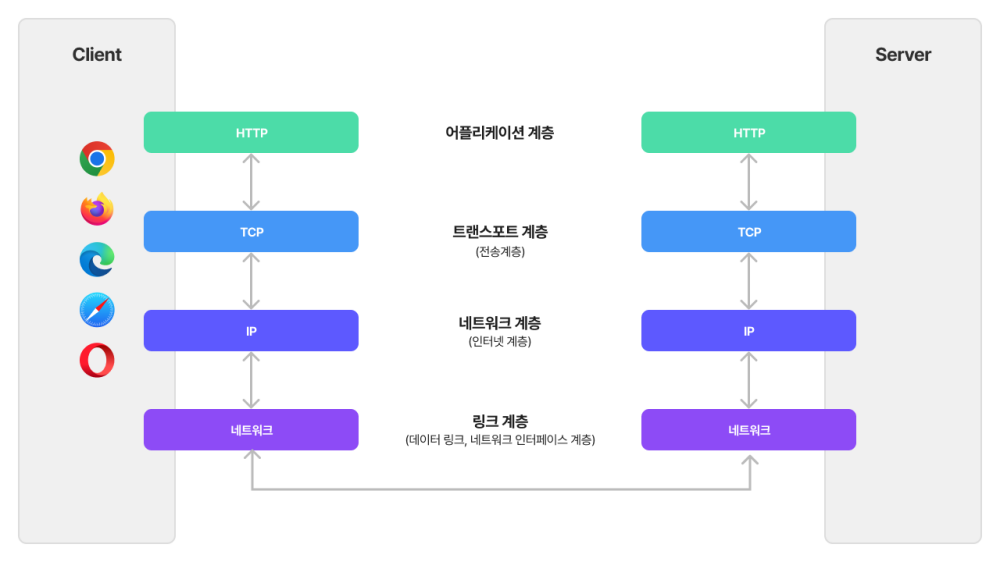
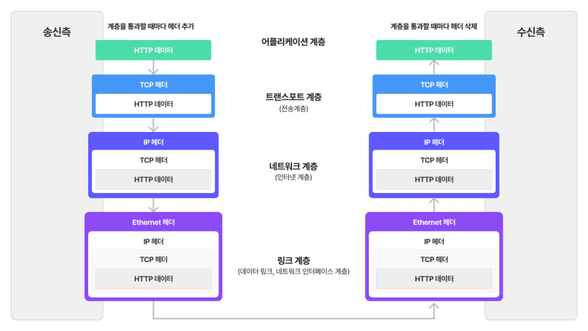
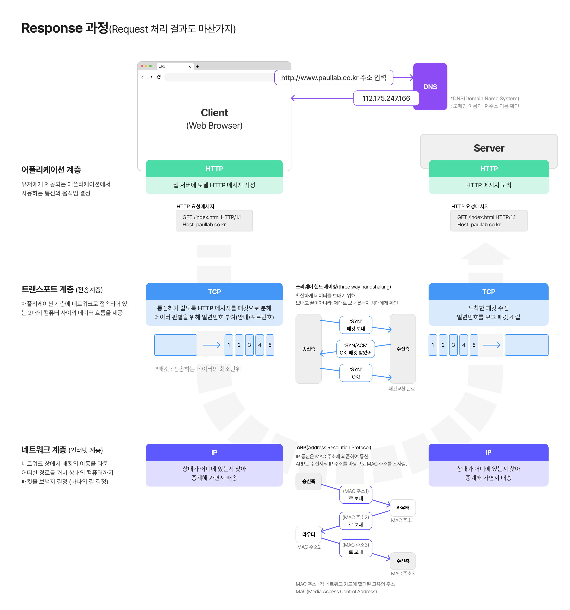
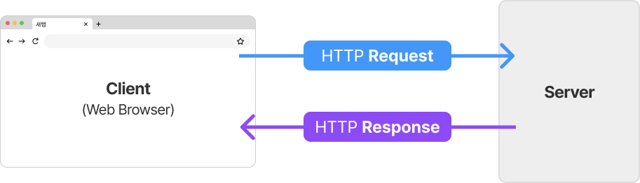
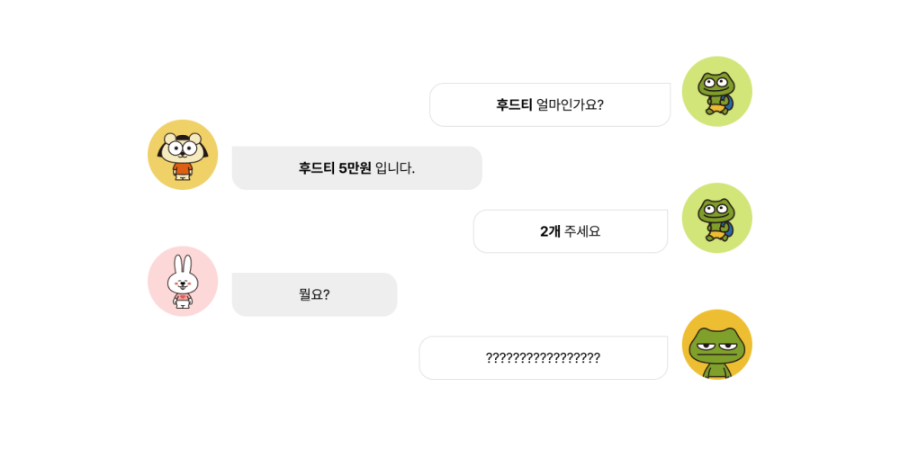
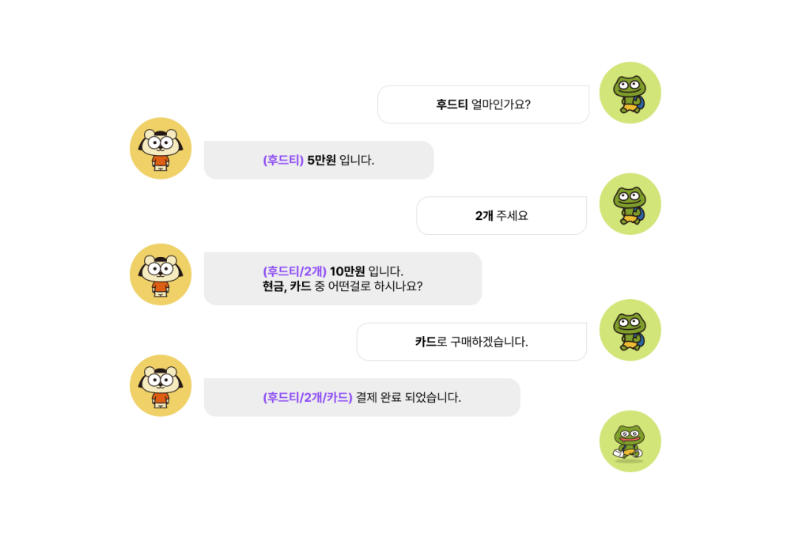
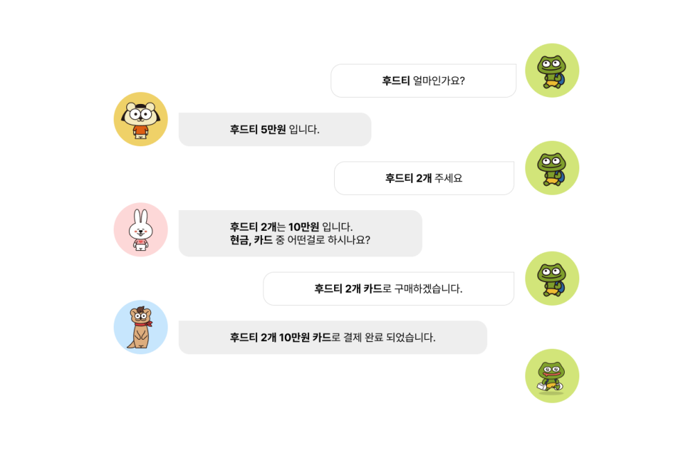
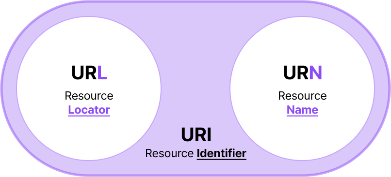
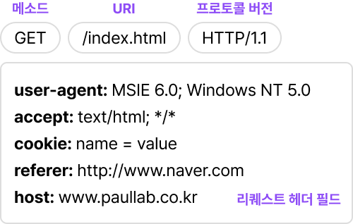
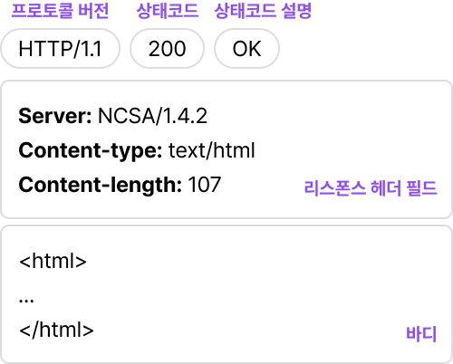

# HTTP/HTTPS

## 개요

- https로 되면 security가 붙어서 전달되는 패킷을 들여다볼 수 없다.

### **웹브라우저 주소 입력란에 URL을 입력하면?**

> [https://aws.amazon.com/ko/blogs/korea/what-happens-when-you-type-a-url-into-your-browser/](https://aws.amazon.com/ko/blogs/korea/what-happens-when-you-type-a-url-into-your-browser/)

- 브라우저 주소 입력창에 URL을 입력하면 브라우저는 서버에게 해당 주소에 대한 리소스(파일 등의 정보)를 요청(Request)한다.
- 웹 서버는 응답(Response)을 통해 리소스를 전송한다.
- 이때 브라우저와 웹 서버는 HTTP 통신을 사용한다.

<br>

## HTTP란?

- HTTP(HyperText Transfer Protocol) : 하이퍼미디어 문서를 전송하기 위한 프로토콜(약속)

> **Protocol(프로토콜)** : 약속
>
> - 데이터가 전송되는 방식을 결정하는 규약
> - 송/수신자 사이의 합의를 통해 ‘데이터 포맷은 이렇게, 오류제어는 이렇게 해서 데이터를 주고받자!’와 같이 서로 통신할 때 이해할 수 있는 규칙을 만든 것을 의미한다.

- 웹에서 이뤄지는 데이터 통신의 기초. 주로 TCP를 사용.
- 버전 : **HTTP/1.1**
  - 1997년에 공개된 버전으로, 현재 가장 많이 사용되는 버전이다.
  - (RFC2068 → RFC2626이 최신 버전)
  - 현재 HTTP/2.0이 개발되고 있지만, 아직 범용적으로 사용단계는 아니다.
- HTML, XML, Javascript, 오디오, 비디오, 이미지, PDF, Etc
- 요청 또는 상태 라인 / 해더(생략가능) / 빈줄(해더의 끝) / 바디(생략가능)
- **HTTPS** (_HTTP Secure_): HTTP를 security로 감싸서 서버에게 주고, 서버가 암호를 해독해 패킷을 웹 브라우저에게 다시 전달해준다. 웹 브라우저만 패킷을 읽을 수 있는 키를 가지고 있다.

<br>

## TCP/IP

- 인터넷에 관련된 다양한 프로토콜의 집합을 총칭한다.
- HTTP는 TCP/IP 중 하나이다.
- HTMP, FTP, SNMP, TCP, IP, UDP 등이 TCP/IP에 포함된다.

### TCP/IP 4계층

</img>

- **애플리케이션 계층**: 유저에게 제공되는 애플리케이션에서 사용하는 통신의 움직임 결정
- **트랜스포트 계층**(전송 계층) : 애플리케이션 계층에 네트워크로 접속된 2대의 컴퓨터 사이의 데이터 흐름 제공

  > **TCP(Transmission Control Protocol)와 UDP(User Data Protocol)**
  >
  > - 주로 웹브라우저들이 웹 서버에 연결할 때 사용
  > - TCP의 경우 연결 지향적이며 순서가 보장되지만, 상대적으로 느리며, UDP의 경우 비 연결 지향적이며 순서가 보장되지 않지만 빠르다는 장점이 있다.

- **네트워크 계층**(인터넷 계층): 네트워크상에서 패킷의 이동을 다룬다. 여러 가지 길 중에서 하나의 길을 결정하는 것이 네트워크 계층의 역할이다.
  - 패킷 : 전송하는 데이터의 최소단위
- **링크 계층**(데이터 링크 계층/네트워크 인터페이스 계층) : 네트워크에 접속하는 하드웨어적인 면을 다룬다.

### 계층간에 정보는 어떻게 전달할까?

- 각 계층의 정보를 캡슐화해 계층간에 정보를 전달한다.

</img>

</img>

<br>

## 프로토콜의 특징

### 1. Request 요청과 Response 응답

</img>

### 2. Stateless(무상태)

</img>

- 상태(State)라는 개념이 존재하지 않는다.
- 클라이언트와 서버가 연결되지 않아, 그전에 처리된 요청과 응답이 통신에 영향을 주지 않고 독립적으로 처리된다. 즉, 이전 데이터 요청과 다음 데이터 요청은 서로 관계가 없다.
- 요청과 응답을 기다리지 않아 빠르다.

### ex) **Stateful(상태유지)**

</img>

- 항상 같은 서버로 유지해야 한다.
- 단점 : 중간에 서버가 장애가 발생하면 문제가 생긴다.

### ex) Stateless(무상태)

</img>

- 서버를 변경할 수 있다.
- 장점: 서버 설계를 단순하게 할 수 있고, 송수신되는 정보처리를 위한 공간을 동적으로 할당할 수 있으며 이를 제거해 줄 필요가 없다.
- 단점 : 요청마다 필요한 정보를 모두 담아 보내야 한다.

> 💡 데이터를 받아오기 위해 계속해서 새로운 연결을 시도해 성능에 문제가 발생할 수 있다.  
> 이를 해결하기 위해서 **Cookie** 등을 사용한다. HTTP Cookie는 상태가 있는 세션을 만든다.

> ❓ 상태, 무상태는 HTTP header 공부 시 나올 수 있는 개념이다.  
> 예를 들어, 접속 현황을 실제로 유지할 필요가 있는지? 로그인을 몇시간 뒤에 종료해야 하는지?’ 등을 체크하기 위해서 무상태, 상태 유지 개념이 필요하다.

<br>

## URL

### **URI(Uniform Resource Identifier, 통합 자원 식별자)**

- URI는 위치(Locator), 이름(Name) 또는 둘 다 추가로 분류될 수 있다.

</img>

- **URI** (Uniform Resource Identifier)
  - **Uniform**: 리소스 식별하는 통일된 방식
  - **Resource** : 자원, URI로 식별할 수 있는 모든 것(제한 없음)
  - **Identifier**: 다른 항목과 구분하는데 필요한 정보
- **URL** - locator : 리소스가 있는 **위치**를 지정
- **URN** - Name : 리소스에 **이름**을 부여
- **위치(주소)는 변할 수 있지만, 이름은 변하지 않는다!**

</aside>

### **URL(Uniform Resource Locator)**

- 웹사이트를 표시하기 위해 입력하는 주소
- 자원이 어디 있는지를 알려주기 위한 규약
- 흔히 웹사이트 주소로 알고 있지만, **URL은 웹사이트 주소뿐만 아니라 컴퓨터 네트워크상의 자원을 모두 가르킨다.**
- scheme: http, File 등
- port: 문
  - 0번 ~ 1023번: 잘 알려진 포트 (well-known port)
  - 1024번 ~ 49151번: 등록된 포트 (registered port)
  - 49152번 ~ 65535번: 동적 포트 (dynamic port)


<br>

## HTTP 메시지 구조

### Request

```
GET /index.html HTTP/1.1
user-agent: MSIE 6.0; Windows NT 5.0
accept: text/html; */*
cookie: name = value
referer: http://www.naver.com
host: www.paullab.co.kr
```

</img>

1. 데이터 처리 방식(요청 메서드), 기본 페이지, 프로토콜 버전
2. **User-Agent**: 사용자 웹 브라우저 종류 및 버전 정보.
3. **Accept:** 웹 서버로부터 수신되는 데이터 중 웹 브라우저가 처리할 수 있는 데이터 타입을 의미.

   여기서 text/html은 text, html 형태의 문서를 처리할 수 있고,  */*는 모든 문서를 처리할 수 있다는 의미. (이를 MIME 타입이라 부르기도 한다.)

4. **Cookie:** HTTP 프로토콜 자체가 세션을 유지하지 않는 State-less(접속상태를 유지하지 않는) 방식이기 때문에 로그인 인증을 위한 사용자 정보를 기억하려고 만든 인위적인 값이다. 사용자가 정상적인 로그인 인증 정보를 가지고 있다는 것을 판단하려고 사용한다.
5. **Referer:** 현재 페이지 접속 전에 어느 사이트를 경유했는지 알려주는 도메인 혹은 URL 정보.
6. **Host:** 사용자가 요청한 도메인 정보.

### HTTP 요청 메서드 예시

1. **GET: 서버야 네가 가진 유저 정보 좀 줘!**

```
GET /user HTTP/1.1
Host 146.56.183.55:5050/
```

```jsx
fetch("http://146.56.183.55:5050/user", {
  method: "GET",
})
  .then((response) => response.json())
  .then((data) => {
    console.log("성공:", data);
  })
  .catch((error) => {
    console.error("실패:", error);
  });
```

2. **POST: 서버야 새로운 유저 정보를 줄게! 데이터를 생성해줘!**

```
POST /user HTTP/1.1
Host 146.56.183.55:5050/
Content-Length: 1560
```

```jsx
const data = {
  user: {
    email: "post@post.com",
    password: "post1234",
    username: "콘푸라이트",
    accountname: "posttest",
    intro: "시리얼은 포스트 콘푸라이트",
    img: null,
  },
};

fetch("http://146.56.183.55:5050/user", {
  method: "POST",
  headers: {"Content-Type": "application/json"},
  body: JSON.stringify(data),
})
  .then((response) => response.json())
  .then((data) => {
    console.log("성공:", data);
  })
  .catch((error) => {
    console.error("실패:", error);
  });
```

1. **PUT: 서버야 유저 정보를 덮어씌워 줘!**

```
PUT /user HTTP/1.1
Host 146.56.183.55:5050/
Content-Type: application/json
Content-Length: 1560
Authorization: 토큰값
```

```jsx
const data = {
  user: {
    username: "콘푸로스트",
    accountname: "posttest",
    intro: "시리얼은 역시 호랑이기운이 켈로그 콘푸로스트!",
    img: null,
  },
};

fetch("http://146.56.183.55:5050/user", {
  method: "PUT",
  headers: {
    "Content-Type": "application/json",
    Authorization: `Bearer ${토큰값}`,
  },
  body: JSON.stringify(data),
})
  .then((response) => response.json())
  .then((data) => {
    console.log("성공:", data);
  })
  .catch((error) => {
    console.error("실패:", error);
  });
```

1. **DELETE: 서버야 있던 유저 정보를 삭제해줘!**

```
DELETE /user HTTP/1.1
Host 146.56.183.55:5050/
```

---

## Response

```
HTTP/1.1 200 OK
Server: NCSA/1.4.2
Content-type: text/html
Content-length: 107

<html>
...
</html>
```

</img>

1. 웹 프로토콜 버전 및 응답 코드 정보가 포함.
2. 웹 애플리케이션 종류 및 버전 정보가 포함.
3. MIME 타입 정보가 포함.

   - 클라이언트에게 전송된 문서의 다양성을 알려주기 위한 메커니즘

   [MIME 타입 - HTTP | MDN](https://developer.mozilla.org/ko/docs/Web/HTTP/Basics_of_HTTP/MIME_types)

4. 수신 Body 사이즈 정보가 포함.
5. 사용자가 요청한 웹 페이지 정보가 포함.

### 응답의 결과를 알려주는 상태코드

- 서버에 요청을 보냈을 때, 서버가 요청이 어떻게 처리되었는지 알려주는 역할을 합니다.
- 프론트엔드 개발자는 이 상태코드를 확인하고 에러를 처리할 수 있습니다.
- 모든 상태코드를 외우거나 알 필요는 없습니다. 주요한 상태코드만 알아두시고, 필요에 따라 검색하시면 됩니다.

### 2xx

| 200 | 서버가 요청을 제대로 처리.                       |
| --- | ------------------------------------------------ |
| 201 | 성공적으로 요청되었으며 서버가 새 리소스를 작성. |
| 202 | 서버가 요청을 접수했지만 아직 처리하지 않음.     |

### 3xx

| 301 | 요청한 페이지를 새 위치로 영구적으로 이동. |
| --- | ------------------------------------------ |

### 4xx

| 400 | Bad Request. 잘못된 요청                                        |
| --- | --------------------------------------------------------------- |
| 401 | Unauthorized. 권한 없이 요청. Authorization 헤더가 잘못된 경우. |
| 403 | Forbidden. 서버가 요청을 거부.                                  |
| 404 | 서버가 요청한 페이지를 찾을 수 없음.                            |

### 5xx

- 서버 쪽에서 오류가 난 경우입니다. 이때는 백엔드 개발자에게 물어봐야겠죠.

| 500 | 서버에 오류가 발생하여 요청을 수행할 수 없음.                                 |
| --- | ----------------------------------------------------------------------------- |
| 503 | 서버가 오버로드되었거나 유지관리를 위해 다운되었기 때문에 현재서버 사용 불가. |

<br>

## HTTPS란?

- 패킷 내 데이터가 Encrypted Application Data라는 곳에 담겨 확인할 수 없다. 도청(패킷 스니핑)을 해도 확인 불가능하다.

다만 본인인 경우 요청하고 있는 PC의 웹프라우저 **Pre-Master Secret 파일을 획득하여 Wireshark 에 등록**하면 가능합니다. 그럼 해당 암호화 된 문자열을 **복호화** 하여 확인할 수 있습니다.

복호화 해서 보면 HTTP 양식으로 통신을 하고 있는 것을 볼 수 있습니다.

### HTTPS의 장점

> HTTP + 암호화 + 인증 + 완전성 보호 = HTTPS

**HTTPS는 암호화로 도청을 막을 수 있다.**

- HTTP는 암호화하지 않은 평문의 통신이기 때문에 도청의 위험이 있다.
- 통신 암호화. SSL(Secure Socket Layer)이나 TLS(Transport Layer Security)이라는 다른 프로토콜을 조합하여 HTTP를 암호화한다.
- SSL을 조합한 HTTP를 HTTP Secure, HTTP over SSL이라고 부른다.

**HTTPS는 통신 상대를 확인한다.**

- HTTP는 통신 상대를 확인하지 않기 때문에 위장할 수 있다.
- SSL은 암호화뿐만 아니라 통신 상대를 확인하는 수단으로 증명서를 제공한다.
- 증명서는 신뢰할 수 있는 기관에 의해 발행되고, 서버나 클라이언트의 실재를 증명해준다. 이러한 증명서를 위조하는 것이 상당이 어렵다.
- 통신 상대가 내가 통신하고자 하는 상대인지 아닌지를 판단할 수 있다.

**HTTPS는 변조를 방지할 수 있다.**

- 중간자 공격: 통신 중의 요청 또는 응답을 빼앗아 변조하는 공격
- HTTP는 완전성을 증명할 수 없으므로, 중간에 변조가 되었다고 해도 알아차리지 못한다.
- 현재 변조 방지를 위해 자주 사용되고 있는 방식: MD5나 SHA-1등의 해시값을 확인하거나 파일의 디지털 서명을 확인하는 방법 (완벽하게 막을 수는 없다.)
- SSL에는 인증이나 암호화, 그리고 강화된 인증 기능을 제공한다.
