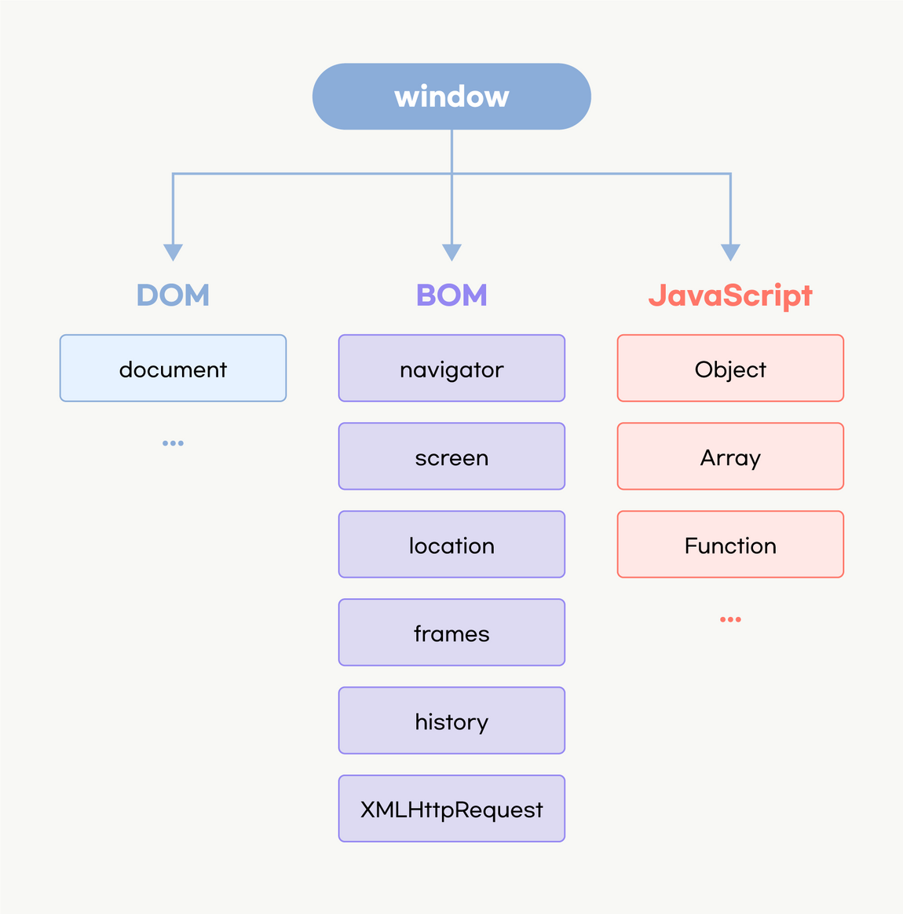

# DOM

</img>

## DOM이란?

- document를 객체화한다.
- HTML 문서의 내용을 트리형태로 구조화하여 웹페이지와 프로그래밍 언어를 연결시켜주는 역할을 한다.
- 이때 각각의 요소와 속성, 콘텐츠를 표현하는 단위를 **노드**라고 한다.

<br>

## DOM 트리에 접근하기

- document 객체를 통해 HTML 문서에 접근 가능하다.
- document는 브라우저가 불러온 웹페이지를 나타내며, DOM 트리의 진입점 역할을 수행한다.

<br>

### DOM 트리에 접근할 수 있는 메서드

`document.getElementById();`

- 인자에 들어간 Id를 가진 요소에 접근한다.
- 해당하는 요소 객체를 반환한다.
- 해당하는 Id를 가진 요소가 존재하지 않는 경우에는 `null`을 반환한다.

```html
<div id="myDiv">div 입니다!</div>
```

```js
const myDiv = document.getElementById("myDiv");
console.log(myDiv); // div#myDiv 객체
```

`document.getElementsByTagName()`

- 해당하는 모든 요소를 접근한다.
- **HTMLCollection이 반환된다.**

```html
<div id="myDiv">div 입니다!</div>
<div id="myDiv">div 입니다!</div>
<div id="myDiv">div 입니다!</div>
<div id="myDiv">div 입니다!</div>
<div id="myDiv">div 입니다!</div>
```

```js
console.log(document.getElementsByTagName("div"));
// HTMLCollection(5) [div#myDiv, div#myDiv, div#myDiv, div#myDiv, div#myDiv, myDiv: div#myDiv]
```

`document.getElementsByClassName()`

- 해당하는 클래스를 가진 모든 요소에 접근한다.
- **HTMLCollection이 반환된다.**
- HTMLCollection은 유사 배열 객체로, 인덱스로 접근이 가능하다.

```html
<div class="myDiv">div 입니다!</div>
```

```js
const myDiv = document.getElementsByClassName("myDiv");
console.log(myDiv); // HTMLCollection
```

> ❗️ 최적화 팁
>
> - document 부터 탐색하기보다 **기준점이 되는 요소**를 가져와서 기준점 요소부터 탐색하면 탐색 속도가 빨라진다.

```html
<article id="container">
  <ul>
    <li>탕수육</li>
    <li class="item-second">유산슬</li>
    <li>짜장면</li>
  </ul>
</article>
```

```js
// 기준점 요쇼로 container라는 id를 갖는 요소를 가져온다.
const container = document.getElementById("container");
console.log(container.getElementsByClassName("item-second"));
```

`document.querySelector("selector")`

- CSS 선택자로 단일 요소에 접근한다.

```html
<article id="container">
  <ul>
    <li>탕수육</li>
    <li class="item-second">유산슬</li>
    <li>짜장면</li>
  </ul>
</article>
```

```js
console.log(document.querySelector(".item-second"));
```

`document.querySelectorAll("selector")`

- CSS 선택자로 여러 요소에 접근한다.
- **NodeList가 반환된다.**
- NodeList는 유사 배열 객체이다.

```html
<article id="container">
  <ul>
    <li>탕수육</li>
    <li class="item-second">유산슬</li>
    <li>짜장면</li>
  </ul>
</article>
```

```js
console.log(document.querySelectorAll(".item-second"));
```

<br>

## DOM 트리 제어하기

### DOM 제어 명령어

1. **이벤트 삽입**

`target.addEventListener( type, listener )`

- 이벤트 타입에는 click, mouseover, mouseout, wheel 등 다양한 이벤트가 있다.
- **listener 함수**의 인수에는 이벤트에 대한 정보가 담겨있다.

```html
<button>HELLO!</button>
```

```jsx
const myBtn = document.querySelector("button");

myBtn.addEventListener("click", function () {
  console.log("hello world");
});
```

<br>

2. **클래스 제어**

DOM api를 통해 요소의 **class 속성**을 제어할 수 있다.

myBtn.classList.add(): 지정한 클래스 값을 추가한다.

```html
<button>Make me BLUE!</button>
```

```js
const myBtn = document.querySelector("button");

myBtn.addEventListener("click", function () {
  // blue 라는 클래스의 속성 값 지정
  myBtn.classList.add("blue");

  myBtn.classList.remove("blue"); // 클래스를 제거합니다.
  myBtn.classList.toggle("blue"); // 클래스를 토글합니다. 없으면 넣어주고, 있으면 제거합니다.
  myBtn.classList.contains("blue"); // 해당하는 클래스가 있는지 확인합니다.
});
```

❗️`element.classList.contains` 활용 용도

- 조건문 제어

```js
if(어떤 클래스 있으면 이거 실행) {

}
```

<br>

3. **요소 제어**

DOM api를 이용하면 요소를 새롭게 생성하고, 위치하고 제거할 수 있다.

- `document.createElement(target)`: target 요소를 생성한다.
- `document.createTextNode(target)` : target 텍스트 노드를 생성한다.
- `element.appendChild(target)` : target 요소를 element의 자식으로 위치시킨다.
- `element.removeChild(target)` : element의 target 자식 요소를 제거한다.

예시1)

```html
<ul></ul>
<button>Make me MORE!</button>
```

```js
const myBtn = document.querySelector("button");
const myUl = document.querySelector("ul");

const myBtn = document.querySelector("button");
const myUl = document.querySelector("ul");

myBtn.addEventListener("click", function () {
  for (let i = 0; i < 5; i++) {
    // li 요소를 생성한다.
    const myLi = document.createElement("li");
    // text 노드를 생성한다.
    const myTxt = document.createTextNode("안녕하세용!" + i);

    // 자식 요소를 배치한다.
    myLi.appendChild(myTxt);
    myUl.appendChild(myLi);
  }

  const li = document.querySelector("li");
  // 자식 요소를 제거한다.
  myUl.removeChild(li);
});
```

`parentElement.insertBefore(target, location)`

- target요소를 parentElement의 자식인 location 위치 앞으로 넣는다.

예시2)

```html
<div id="parentElement">
  <span id="childElement">hello guys~</span>
</div>
```

```js
const span = document.createElement("span");
const sibling = document.getElementById("childElement");
const parentDiv = document.getElementById("parentElement");
parentDiv.insertBefore(span, sibling);
```

<br>

4. **JavaScript 문자열을 사용해 element, text 노드를 생성하거나 추가하기**

DOM api를 이용하면 요소 안의 값에 접근하여 값을 가져오거나, 변경할 수 있다.

- `element.innerHTML`: 요소 내에 포함된 HTML 마크업을 가져오거나 HTML 마크업을 삽입할 수 있다.
  - 크로스 사이트 스크립팅 공격 위험성이 존재한다.
- `element.innerText`: 요소의 **렌더링**된 텍스트 콘텐츠를 표현한다. 즉, **사람이 읽을 수 있는** 요소만 처리한다.
- `element.textContent`: 노드의 텍스트 콘텐츠를 있는 그대로 표현한다.

```html
<p></p>
<input type="text" />
<button>Write Something!</button>
```

```js
const myBtn = document.querySelector("button");
const myP = document.querySelector("p");
const myInput = document.querySelector("input");

myBtn.addEventListener("click", function () {
  myP.textContent = myInput.value;
});

// input 요소에 'input' 이벤트를 연결하면 실시간으로 값이 반영되게 만들 수도 있습니다.
myInput.addEventListener("input", () => {
  myP.textContent = myInput.value;
});

myP.innerHTML = "<strong>I'm Strong!!</strong>";
myP.outerHTML = "<div></div>";
```

> 📓 **innerText** vs **textContent**
>
> innerText는 렌더링을 거쳐서 렌더링된 텍스트 콘텐츠를 표현하기에 속도가 있는 그대로 표현하는 textContent보다 느리다. 따라서 렌더링 최적화를 위해서는 textContent를 쓰는 것이 좋다!
> (innerHTML도 마찬가지!)

```js
// 1번
myP.innerHTML = "<strong>I'm Strong!!</strong>";

// 2번
const elStrong = document.createElement("strong");
const myTxt = document.createTextNode("I'm strong!!");
elStrong.appendChild(myTxt);
myP.appendChild(elStrong);
```

- 1번 방식보다 2번 방식이 더 **빠르다**.
- 하지만 실무에서는 마크업이 매우 복잡해짐에 따라 1번 방식으로 한번에 마크업을 추가하는 방식이 선호되기도 한다.

> innerHTML 사용시 주의 사항 : [https://developer.mozilla.org/ko/docs/Web/API/Element/innerHTML#security_considerations](https://developer.mozilla.org/ko/docs/Web/API/Element/innerHTML#security_considerations)

> innerText와 textContent의 차이 : [https://developer.mozilla.org/ko/docs/Web/API/HTMLElement/innerText#예제](https://developer.mozilla.org/ko/docs/Web/API/HTMLElement/innerText#%EC%98%88%EC%A0%9C)

<br>

5. **더 인접한곳(**Adjacent**)으로 정밀하게 배치하기**  
   `element.insertAdjacentHTML` : 요소 노드를 주어진 위치에 배치한다.

- position으로 들어갈 수 있는 단어

  `'beforebegin'` : element 앞에

  `'afterbegin'` : element 안에 가장 첫번째 자식 요소

  `'beforeend'` : element 안에 가장 마지막 자식 요소

  `'afterend'` : element 뒤에

```html
<strong class="sayHi"> 반갑습니다. </strong>
```

```js
const sayHi = document.querySelector(".sayHi");
sayHi.insertAdjacentHTML("beforebegin", "<span>안녕하세요 저는</span>");
sayHi.insertAdjacentHTML("afterbegin", "<span>재현입니다</span>");
sayHi.insertAdjacentHTML("beforeend", "<span>면접오시면</span>");
sayHi.insertAdjacentHTML("afterend", "<span>치킨사드릴게요</span>");
```

<br>

6. **DOM 안에서 노드 탐색하기**

```html
<!-- 주석입니다 주석. -->
<article class="cont">
  <h1>안녕하세요 저는 이런 사람입니다.</h1>
  <p>지금부터 자기소개 올리겠습니다</p>
  Lorem ipsum dolor sit amet consectetur adipisicing elit. Deserunt incidunt voluptates laudantium fugit, omnis dolore itaque esse exercitationem quam culpa praesentium, quisquam repudiandae aut. Molestias qui quas ea iure officiis.
  <strong>감사합니다!</strong>
</article>
```

```js
const cont = document.querySelector(".cont");
console.log(cont.firstElementChild); // 첫번째 자식을 찾습니다.
console.log(cont.lastElementChild); // 마지막 자식을 찾습니다.
console.log(cont.nextElementSibling); // 다음 형제요소를 찾습니다.
console.log(cont.previousSibling); // 이전 형제노드를 찾습니다. 줄바꿈 노드를 가리킨다.
console.log(cont.previousElementSibling); // 형제 요소 노드를 찾는다.
console.log(cont.children); // 모든 직계자식을 찾아서 HTMLCollection으로 반환
console.log(cont.childNodes); // 모든 자식을 찾아 NodeList로 반환한다.
console.log(cont.parentElement); // 부모 요소를 찾습니다.
console.log(cont.parentNode);
```

<br>

## 이벤트 객체

- 이벤트에서 호출되는 핸들러에 전송되는 **이벤트와 관련된 모든 정보**를 가지고 있는 매개변수

```html
<article class="parent">
  <ol>
    <li><button class="btn-first" type="button">버튼1</button></li>
    <li><button type="button">버튼2</button></li>
    <li><button type="button">버튼3</button></li>
  </ol>
</article>
```

```js
const btnFirst = document.querySelector(".btn-first");
btnFirst.addEventListener("click", (event) => {
  console.log(event);
});
```
