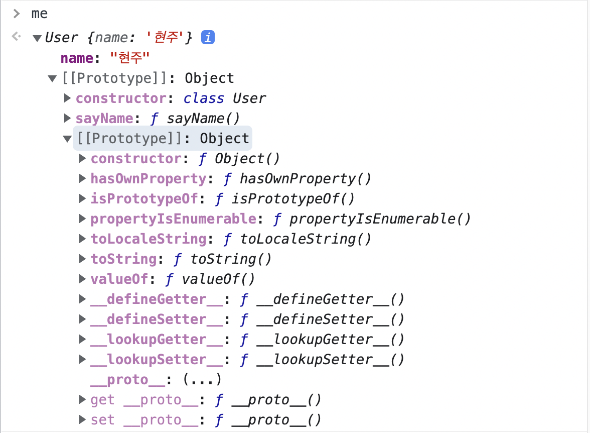

# 클래스

## 클래스란?

- 자바스크립트는 프로토타입 기반 객체지향 언어로 ES5까지는 생성자 함수를 사용해 비슷한 구조의 객체를 생성해왔다.
- ES6에서 등장한 클래스로 다른 프로그래밍 언어의 클래스 문법과 같이 사용하여 훨씬 더 깔끔한 문법으로 객체(인스턴스)를 생성할 수 있게 되었다.

<br>

생성자 함수 사용

```JavaScript
// 생성자 함수
function UserOld(name) {
  this.name = name;
}

UserOld.prototype.sayName = function() {
  console.log(this.name);
}

const user = new UserOld("현주");
user.sayName();
```

클래스 사용

```JavaScript
class User {
  // 클래스의 생성자 함수로, 인스턴스가 만들어질 때 자동으로 사용된다.
  constructor(name) {
    this.name = name;
  }
  sayName() {
    console.log(this.name);
  }
}

// 클래스도 결국 객체를 만들기 위해 사용한다.
const me = new User("현주");
me.sayName();
```

</img>

- 클래스로 생성된 객체를 출력해보면 생성자 함수로 생성한 객체와 **내부적인 동작이 일치**한다.
- 클래스도 사실은 함수이며 기존 프로토타입 기반 패턴을 클래스 기반 패턴처럼 사용할 수 있도록 하는 **문법적 설탕**이라고 할 수 있다.

<br>

## 클래스 내에 정의할 수 있는 메소드:

**constructor(생성자), 프로토타입 메서드, 정적 메서드**

생성자 함수와 클래스의 정의 방식을 비교해보면 다음과 같다.

- 생성자 함수로 객체 생성하기

```JavaScript
// 생성자 함수
function User(name) {
  this.name = name;
}

// 프로토타입 메서드
User.prototype.sayHi = function () {
  console.log(`hi ${this.name}`);
}

// 정적 메서드
User.sayHello = function () {
  console.log(`hello`);
}

const me = new User("현주");
```

- 클래스로 객체 생성하기

```JavaScript
class User2 {
  // 생성자
  constructor (name) {
    this.name = name;
  }

  // 프로토타입 메서드
  sayHi() {
    console.log(`hi ${this.name}`);
  }

  // 정적 메소드
  static sayHello() {
    console.log(`hello`);
  }
}

const me = new User2("현주");
```

<br>

### 생성자 메소드 `constructor()`

- 객체의 기본 상태를 설정해준다.
- new 연산자에 의해 자동으로 호출된다.

<br>

### 프로토타입 메소드

- 클래스가 생성한 인스턴스를 통해 사용가능하다.

<br>

### 정적 메소드

- 클래스가 소유한 메소드
- 클래스도 함수 객체로 평가되므로 자신의 프로퍼티/메소드를 가질 수 있다.

<br>

**프로토타입 메서드와 정적 메서드 내의 this 차이**

```JavaScript
class User {
    // 클래스의 생성자 함수로, 인스턴스가 만들어질 때 자동으로 사용된다.
    constructor(name) {
      this.name = name;
    }

    sayName() {
      console.log(this);
      return `hi ${this.name}`;
    }

    static sayHello() {
      console.log(this);
      return `hello ${this.name}`;
    }
  }

  // 클래스도 결국 객체를 만들기 위해 사용한다.
  const me = new User("현주");
  // this가 각각 무엇을 가리킬까?
  me.sayName();
  User.sayHello();
```

- 프로토타입 메서드는 인스턴스로 호출을 하므로 this 메서드를 호출한 **인스턴스**를 가리킨다.
- 정적 메서드는 클래스로 호출을 하므로 this는 **클래스**를 가리킨다.

<br>

## 클래스 상속

- 클래스 상속을 통해 특정 클래스의 기능을 다른 클래스에서 **재사용**할 수 있다.

<br>

### `extends`

- `extends` 키워드를 사용하여 슈퍼 타입의 프로퍼티를 상속받을 수 있다.

```JavaScript
// 수퍼/부모/베이스 클래스
class Sausage {
  constructor(el1, el2) {
    this.inside1 = el1;
    this.inside2 = el2;
  }

  taste() {
    return this.inside1 + "와 " + this.inside2 + " 맛이 난다!";
  }
}

const classicSausage = new Sausage("닭고기", "양파");
console.log(classicSausage.taste());

// 서브/파생/자식 클래스
class FireSausage extends Sausage {

}

const classicFireSausage = new FireSausage("소고기", "파", "불맛");
console.log(classicFireSausage.taste());
console.log(classicFireSausage.inside1);
console.log(classicFireSausage.inside2);

```

<br>

### `super`

- `super` 키워드를 호출하거나 참조하여 슈퍼 클래스의 생성자와 메서드를 사용할 수 있다.

**super 호출**

- super를 **호출**하면 슈퍼 클래스의 constructor(생성자)를 호출하여 사용할 수 있다.

  ```JavaScript
  class Sausage {
    constructor(el1, el2) {
      this.inside1 = el1;
      this.inside2 = el2;
    }

    taste() {
      return this.inside1 + "와 " + this.inside2 + " 맛이 난다!";
    }
  }

  const classicSausage = new Sausage("닭고기", "양파");
  console.log(classicSausage.taste());

  // 상속 받을 클래스
  class FireSausage extends Sausage {
    // 자식 클래스에 constructor 함수를 선언하면 부모 클래스의 constructor 함수를 덮어쓴다.
    constructor(el1, el2, el3) {
      super(el1, el2);
      this.inside3 = el3;
    }

    flavor() {
      return this.inside3 + "의 풍미도 있다!";
    }
  }

  const classicFireSausage = new FireSausage("소고기", "파", "불맛");
  console.log(classicFireSausage.flavor());

  ```

- super 메소드를 통해 자식 클래스의 생성자 함수가 부모 클래스의 생성자 함수를 덮어 씌우는 것을 방지할 수 있다.

<br>

**super 참조**

- super를 **참조**하면 슈퍼 클래스의 메서드를 호출할 수 있다.

  ```JavaScript
  class Parent {
    constructor(name) {
      this.name = name;
    }

    sayHi() {
      return `Hi ${this.name}`;
    }
  }

  class Child extends Parent {
    sayHi() {
      return `${super.sayHi()}. I\'m child class`;
    }
  }

  const user = new Child("현주");
  console.log(user.sayHi()); // Hi 현주. I'm child class
  ```

<br>

## public한 인스턴스 프로퍼티

- ES6의 클래스는 생성자 함수와 마찬가지로 다른 클래스 기반 객체지향 언어에서 지원하는 private, public, protected와 같은 접근 제한자를 지원하지 않는다.

- 클래스를 사용해 인스턴스를 생성하면 인스턴스의 프로퍼티를 외부에서 언제든 접근 가능하다. ➡️ 즉, **public 하다.**

### 만약 프로퍼티가 중요한 데이터라면?!

- 인스턴스 내 프로퍼티가 매우 중요한 데이터여서 외부에서 함부로 수정할 수 없게 하기 위해서는 비공개 프로퍼티로 변경할 필요가 있다.
- 이때, `#` 키워드를 사용하여 private한 프로퍼티를 정의해줄 수 있다.

```JavaScript
class User {
  #password;

  constructor(name, password) {
    this.name = name;
    this.#password = pw;
  }
}

const me = new Person("현주", 1234);
console.log(me.#password); // private하므로 외부에서 접근 불가하다.
```

- private 필드는 해당 클래스를 상속받은 자식 클래스 내부에서도 사용할 수 없다.  
  ➡️ private 프로퍼티에게는 private 프로퍼티가 속한 클래스를 제외한 모든 곳이 외부이다.

<br>

> 📓 정리
>
> 1. 자바스크립트 타입 생성 방법을 다른 언어랑 비슷하도록 쉽게 개선한 것이 JS의 클래스이다.
> 2. `extends` 키워드로 상위 타입의 프로퍼티를 상속받고, super 키워드로 슈퍼 클래스의 생성자와 메소드를 사용할 수 있다.
> 3. `#` 키워드를 통해 클래스 내부에 private한 프로퍼티를 정의할 수 있다.
