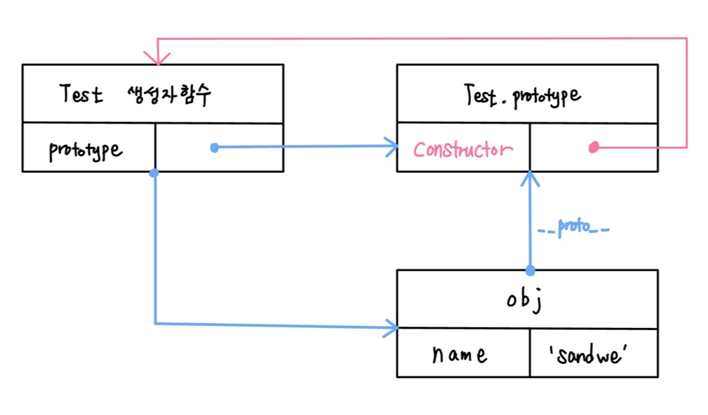

# 객체지향 프로그래밍

## 객체지향 프로그래밍이란?

- 객체지향은 프로그래밍 방법론중에 하나로, 프로그램을 작성할 때 객체들을 만들어 서로 소통하도록하는 방법

### 여기서 말하는 객체란?

- 자바스크립트 객체: 데이터의 묶음
- 객체 지향의 객체: 표현하고자 하는 구체적인 사물을 추상적으로 표현한 것
  - 객체는 행동(메소드)과 상태(프로퍼티)를 가진다.

<br>

## 1. 객체 리터럴을 사용한 객체 생성하기

```jsx
const me = {
  name: "sandwe",
  address: "oo도 oo시",
  phoneNum: "010-1234-5678",
  canWalk: function () {
    console.log("sandwe가 걷는다.");
  },
};

const me = {
  name: "sandwe",
  address: "oo도 oo시",
  phoneNum: "010-1234-5678",
  canWalk: function () {
    console.log("sandwe가 걷는다.");
  },
  eatSpicyFood: function (food) {
    food.eat();
  },
};

const food = {
  spicyLevel: 1,
  eat: function () {
    console.log("더 이상 맵찔이가 아니야.");
    this.spicyLevel++;
  },
};

me.eatSpicyFood();
```

객체와 객체가 서로 메소드를 통해 상호작용하게 하는것이 바로 **객체지향 프로그래밍**이라고 할 수 있다.

### **객체 리터럴을 사용한 객체 추상화의 문제점?**

- 만들어낸 객체는 한번 생성하고 나면 끝이다.
- 다음과 같이 객체를 복사하면 **얕은 복사**가 되어 원하지 않는 객체의 값도 바뀔 수 있다.

```jsx
const food = {
  spicyLevel: 1,
  eat: function () {
    console.log("더 이상 맵찔이가 아니야.");
    this.spicyLevel++;
  },
};

const food2 = food1; // 얕은 복사
food1 === food2; // true
```

- 따라서 어떤 객체와 같은 프로퍼티를 가지는 객체를 생성하기 위해서는 지금 상태에서는 작성한 코드를 반복해 새로운 객체를 만들 수 밖에 없다.

<br>

## 2. **생성자 (constructor)**

> 생성자를 사용하면 효율적으로 객체를 생성할 수 있다.

- **생성자:** 객체를 만들 때 new 연산자와 함께 사용하는 함수
- 내장 생성자

```jsx
let myArr = new Array(1, 2, 3);
```

### **생성자를 사용했을 때의 장점?**

- 생성자 함수를 통해 생성된 객체는 같은 **프로퍼티**와 **메서드**를 공유할 수 있다.

```jsx
let myArr = new Array(1, 2, 3);
let myArr2 = new Array(4, 5, 6);

myArr2.length;
myArr.length;

myArr.forEach((item) => {
  console.log(item);
});

myArr2.forEach((item) => {
  console.log(item);
});
```

### 커스텀 생성자 만들어보기

- 생성자는 기본적으로 함수이다.
- 생성자 함수는 암묵적으로 대문자로 시작하는 이름을 가지는 것으로 약속되어 있다.
- 생성자 함수로 객체를 생성하기 위해서는 new 키워드를 붙여 함수를 호출한다.

```jsx
function Factory() {
  // ...
}

let robot1 = new Factory();
```

- Factory 생성자 함수는 따로 return 값을 가지지 않지만 new키워드가 앞에 붙게되면 실행되었을 때 자동적으로 객체를 생성하고 반환한다.
- 생성자 함수는 암묵적으로 this를 반환하기 때문이다.
- 이렇게 반환되어 만들어진 객체를 다른 말로 **인스턴스(instance)** 라고 한다.

🤚 생성자 함수와 객체의 관계는 instanceof 로 확인 할 수 있다.

```jsx
// Factory 생성자 함수가 생성한 객체가 robot1인지를 판별한다.
robot1 instanceof Factory;
```

**ex) 프로퍼티와 메서드를 가진 로봇 객체를 만들어 보자.**

```jsx
function NewFactory(name) {
  this.name = name;
  this.sayYourName = function () {
    console.log(`삐리비리. 제 이름은 ${this.name}입니다. 주인님.`);
  };
}

// 인스턴스(객체) 생성
let robot1 = new NewFactory("브랜든");
```

- 원래 함수 안에서의 this는 함수를 호출한 객체를 참조한다.
- 생성자 함수 앞에 new 연산자가 사용되면 함수안의 this는 **생성자가 만들어낸 객체 즉, 인스턴스를 참조**한다.

실습) 음식 이름의 배열을 전달하면 배열안에서 랜덤하게 메뉴를 뽑아내는 로봇객체의 생성자를 만들기

```jsx
function RobotFactory(array) {
  this.selectRandomMenu = function () {
    console.log(array[Math.floor(Math.random() * array.length)]);
  };
}

const robot1 = new RobotFactory(["짜장면", "짬뽕", "탕수육", "유린기", "가지덮밥", "마파두부"]);
robot1.selectRandomMenu();
```

<br>

## 프로토타입 (prototype)

- 생성자 함수를 사용하여 손쉽게 객체를 생산할 수 있지만, 객체의 메서드를 등록 할때마다 새로운 함수를 생성하여 자원이 낭비되는 문제점이 있다.
- 100개의 객체를 생성할 때매다 100개의 `sayYourName` 메서드가 생성된다.

```jsx
function NewFactory(name) {
  this.name = name;
  this.sayYourName = function () {
    console.log(`삐리비리. 제 이름은 ${this.name}입니다. 주인님.`);
  };
}

const robot1 = new NewFactory("가나");
const robot2 = new NewFactory("다라");
robot1.sayYourName === robot2.sayYourName; // false
```

- 자원의 낭비를 해결하기 위해 등장한 것이 바로 **프로토타입**이다.

```jsx
function NewFactory2(name) {
  this.name = name;
}

NewFactory2.prototype.sayYourName = function () {
  console.log(`삐리비리. 제 이름은 ${this.name}입니다. 주인님.`);
};
```

### **프로토타입(Prototype)이란?**

- 특정 객체에 대한 참조. 즉, 어떤 공간을 가르킨다.

> 생성자 함수가 인스턴스를 생성하게 되면 그 안에는 숨겨진 프로퍼티(내부 슬롯)인 [[Prototype]] 이 존재하게 된다. 코드상에서는 `__proto__`로 표현된다. `__proto__` 프로퍼티는 자신을 만든 생성자 함수의 `prototype`을 참조하는 역할을 한다. 즉, new 키워드를 통해 생성자 함수의 `prototype`과 인스턴스의 `__proto__` 가 **생성자 함수의 프로토타입**과 연결된다.

```jsx
function Test(name) {
  this.name = name;
}

const obj = new Test("sandwe");

obj.__proto__ === Test.prototype;
```

</img>

> 💡 잠시만요 … `prototype` 과 `__proto__` 는 다른건가요???
> 네 맞습니다. prototype은 오직 function안에 존재하는 참조값입니다. `__proto__` 는 객체 안에 존재하는 숨겨진 프로퍼티입니다. 인스턴스는 `__proto__`를 통해 생성자 함수의 `prototype`에 접근하여 필요한 여러가지 값과 메서드를 사용할 수 있습니다.

```jsx
function Test() {}

const obj = new Test();

console.log(obj.prototype);
```

이렇듯 프로토타입은 모든 인스턴스가 하나의 메서드를 공유하도록 만들어 자원을 더 효율적으로 사용하도록 도와줍니다. 생성된 객체끼리 메서드를 비교하여 같은 곳을 참조하는지 살펴보는것도 이해하는데 도움이 됩니다.

**실습 1) 우리가 만들었던 음식 로봇객체의 메서드를 프로토타입으로 분리해보세요, 그리고 객체의 메서드가 서로 동일한 주소를 참조하는지 확인해보세요.**

```jsx
function RobotFactory(menu) {
  this.menu = menu;
}
RobotFactory.prototype.selectRandomMenu = function () {
  console.log(this.menu[Math.floor(Math.random() * this.menu.length)]);
};

const robot1 = new RobotFactory(["짜장면", "짬뽕", "탕수육", "유린기", "가지덮밥", "마파두부"]);
const robot2 = new RobotFactory(["연어", "광어", "새우", "우럭", "참치"]);
robot1.selectRandomMenu === robot2.selectRandomMenu; // true
```

**실습 2) 우리가 객체지향 개념에서 만들었던 ‘나’ 와 ‘대상’ 객체를 생성자를 통해서 만들어 볼 수 있도록 코드를 수정해봅시다.**

```jsx
function MyInfo(name, address, phoneNum) {
  this.name = name;
  this.address = address;
  this.phoneNum = phoneNum;
}

MyInfo.prototype.canWalk = function () {
  console.log("sandwe가 걷는다.");
};

MyInfo.prototype.eatSpicyFood = function (food) {
  food.eat();
};

function Food(level) {
  this.spicyLevel = level;
}

Food.prototype.eat = function () {
  this.spicyLevel++;
};

const me = new MyInfo("sandwe", "oo도 oo시", "010-1234-5678");
const food = new Food(1);
```

<br>

## 객체의 상속

### 자바스크립트에서 상속은 어떻게 일어날까?

- 자바스크립트의 상속은 기본적으로 프로토타입을 통해 일어난다.
- `Object.prototype.hasOwnProperty()` : 객체가 특정 프로퍼티를 가지고 있는지 판별한다.

```jsx
const obj = {
  name: "test",
};

console.log(obj.hasOwnProperty("name"));

const arr = [1, 2, 3];

console.log(arr.hasOwnProperty("name"));
```

> Array 함수의 `__proto__` 가 Object 함수의 `prototype`을 참조하고 있기 때문에 Array의 `prototype`에 존재하지 않는 Object 객체의 프로퍼티와 메서드를 사용할 수 있다. 이처럼 자기 자신에게 존재하지 않는 프로퍼티나 메서드를 프로토타입을 통해 추적하는 과정을 **프로토타입 체이닝**이라고 한다.

> 💡 자바스크립트의 타입들은 기본적으로 Object 타입을 상속받는다.

<br>

**ex) 직접 생성한 생성자 함수를 통해 상속을 받도록 해보자.**

```jsx
// 부모 생성자 함수
function Parent() {
  this.name = "sandwe";
}
Parent.prototype.rename = function (name) {
  this.name = name;
};
Parent.prototype.sayName = function () {
  console.log(this.name);
};

// 자식 생성자 함수
function Child() {
  // Child 함수의 this가 Parent의 생성자 함수의 this를 바라보게 한다.
  // 즉, Child를 통해 생성된 인스턴스의 this가 Parent 함수안의 프로퍼티에 접근할 수 있게 한다.
  Parent.call(this);
}

// Child의 프로포타입이 Parent의 프로토타입을 참조하게 한다.
Child.prototype = Object.create(Parent.prototype);
Child.prototype.canWalk = function () {
  console.log("now i can walk!!");
};
```

위의 두 가지 과정을 통해 Child 객체는 Parent 객체의 모든 것을 상속받는다.

<br>

## 클래스(Class)

> 클래스: 붕어빵의 틀이다!

- 자바스크립트는 프로토타입 기반 객체지향 언어로 ES5까지는 생성자 함수를 사용해 비슷한 구조의 객체를 생성해왔다.
- ES6에서 등장한 클래스로 다른 프로그래밍 언어의 클래스 문법과 같이 사용하여 훨씬 더 깔끔한 문법으로 객체(인스턴스)를 생성할 수 있게 되었다.

### 클래스**의 사용법**

- `class 키워드 + 이름 + 대괄호`
- 클래스의 결과물로 인스턴스를 생성한다. 생성자를 이용한 타입 생성과 그 결과가 정확하게 일치한다.

```jsx
class Robot {
  // 클래스의 생성자 함수. 하나의 클래스는 하나의 생성자만 정의할 수 있다.
  // 그리고 생성자 함수는 new 키워드가 호출될때 자동으로 실행된다.
  constructor(name) {
    this.name = name;
  }

  // 메소드를 정의. 메소드는 클래스가 생성한 인스턴스를 통해 사용할 수 있다.
  sayYourName() {
    console.log(`삐리비리. 제 이름은 ${this.name}입니다. 주인님.`);
  }
}
```

> 💡 이처럼 내부적인 동작은 동일하지만 더 보기 좋고 편리하게 개선된 문법을 슈가신텍스 (Syntactic sugar) 라고 부릅니다.

<br>

**실습) 자신의 생성자 함수를 class 문법으로 변경해봅시다.**

```jsx
class MyInfo {
  constructor(name, address, phoneNum) {
    this.name = name;
    this.address = address;
    this.phoneNum = phoneNum;
  }

  canWalk() {
    console.log("sandwe가 걷는다.");
  }

  eatSpicyFood(food) {
    food.eat();
  }
}

class Food {
  constructor(level) {
    this.spicyLevel = level;
  }

  eat() {
    this.spicyLevel++;
  }
}

const me = new MyInfo("sandwe", "oo도 oo시", "010-1234-5678");
const food = new Food(1);
```

<br>

### 클래스 **상속**

- 클래스 상속을 통해 특정 클래스의 기능을 다른 클래스에서 재사용할 수 있다.

`extends`

- `extends` 키워드를 사용해 슈퍼 타입의 프로퍼티를 상속받을 수 있다.

```jsx
// 수퍼/부모/베이스 클래스
class Sausage {
  constructor(el1, el2) {
    this.inside1 = el1;
    this.inside2 = el2;
  }

  taste() {
    return this.inside1 + "와 " + this.inside2 + " 맛이 난다!";
  }
}

const classicSausage = new Sausage("닭고기", "양파");
console.log(classicSausage.taste());

// 서브/파생/자식 클래스
class FireSausage extends Sausage {}

const classicFireSausage = new FireSausage("소고기", "파", "불맛");
console.log(classicFireSausage.taste());
console.log(classicFireSausage.inside1);
console.log(classicFireSausage.inside2);
```

`super`

- super를 호출하면 슈퍼 클래스의 constructor(생성자)를 참조해 호출하여 사용할 수 있다.
- super를 참조하면 슈퍼 클래스의 메서드를 호출할 수 있다.

**super 사용시 주의할 점**

- 만약 파생 클래스에 생성자 함수를 사용하고 싶다면 반드시 super 함수를 사용해야 한다.
- 파생클래스에 생성자 함수가 없다면 super 함수가 자동으로 호출되어 부모 클래스의 프로퍼티를 상속 받게 한다.
- 생성자 함수에서 this 값을 사용할 경우 super 함수는 반드시 this 보다 먼저 실행되어야 한다.
- 파생 클래스가 아닌 클래스에서 사용하려고 해도 에러가 발생한다.

```jsx
class Robot {
  // 클래스의 생성자 함수. 하나의 클래스는 하나의 생성자만 정의할 수 있다.
  // 그리고 생성자 함수는 new 키워드가 호출될때 자동으로 실행된다.
  constructor(name) {
    this.name = name;
  }

  // 메소드를 정의. 메소드는 클래스가 생성한 인스턴스를 통해 사용할 수 있다.
  sayYourName() {
    console.log(`삐리비리. 제 이름은 ${this.name}입니다. 주인님.`);
  }
}

class BabyRobot extends Robot {
  constructor(name) {
    super(name);
    this.ownName = "아이크";
  }

  sayBabyName() {
    // 또한 상속을 받게되면 부모 클래스의 메소드를 사용할 수 있게 됩니다. 때문에 this로 접근 할 수 있습니다.
    this.sayYourName();
    console.log("Suceeding you, Father!");
  }
}

const babyRobot = new BabyRobot("브랜든");
```

### 클로저를 사용한 비공개 프로퍼티 만들기

> 클래스 등장 이전에는 클로저를 이용해 비공개 프로퍼티를 만들었다.

```jsx
function Person() {
  let age = 30; // 비공개 프로퍼티로

  function innerPerson() {}

  innerPerson.prototype.getAge = function () {
    return age++;
  };

  return innerPerson;
}

const PersonFunc = Person();
const person = new PersonFunc();

person.getAge();
```

**IIFE 패턴으로 개선하기**

[IIFE - 용어 사전 | MDN](https://developer.mozilla.org/ko/docs/Glossary/IIFE)

```jsx
const NewPerson = (function () {
  let age = 30;

  function innerPerson() {}
  innerPerson.prototype.getAge = function () {
    return age++;
  };

  return innerPerson;
})();

const personWithSecret = new NewPerson();
personWithSecret.getAge();
```
- 즉시 실행 함수를 사용하면 바로 중첩 생성자 함수를 호출하여 비공개 프로퍼티에 접근할 수 있다.
```js
const NewPerson = (function () {
  let age = 30;

  function innerPerson() {}

  innerPerson.prototype.getAge = function () {
    return age++;
  };

  return innerPerson;
})();

const personWithSecret = new NewPerson();
// personWithSecret.getAge();
```

```jsx
class Robot {
  #password;

  constructor(name, pw) {
    this.name = name;
    this.#password = pw;
  }

  sayYourName() {
    console.log(`삐리비리. 제 이름은 ${this.name}입니다. 주인님.`);
  }

  getPassword() {
    return this.#password;
  }

  setPassword(pw) {
    this.#password = pw;
  }
}
```

```jsx
class Robot {
  #password;

  constructor(name, pw) {
    this.name = name;
    this.#password = pw;
  }

  sayYourName() {
    console.log(`삐리비리. 제 이름은 ${this.name}입니다. 주인님.`);
  }

  get password() {
    return this.#password;
  }

  set password(pw) {
    this.#password = pw;
  }
}

const bot = new Robot("재현", 1234);
```

단점: get 이란 키워드를 사용하면 비공개 프로퍼티를 접근할 수 있다.

**간단한 투두 리스트기능 구현해보기**

1. 해야할 일 Todo 클래스(내용, 상태 두 가지 프로퍼티를 가집니다.)

1. Todo 클래스는 상태를 변경하는 changeState 메서드를 가집니다.
1. 할일의 목록을 관리하는 관리자를 추상화한 TodoManager 클래스 (할일 목록을 프로퍼티로 가집니다.)
1. 할 일을 저장하고(addItem), 할 일의 목록을 보여주며(getItems), 할 일의 남은 갯수를 반환하는(getLeftTodoCount) 세 가지 메소드를 가집니다.

```HTML
<!DOCTYPE html>
<html lang="ko">
  <head>
    <meta charset="UTF-8" />
    <meta http-equiv="X-UA-Compatible" content="IE=edge" />
    <meta name="viewport" content="width=device-width, initial-scale=1.0" />
    <title></title>
  </head>
  <body>
    <script>
      class Todo {
        constructor(item, finished) {
          this.item = item;
          this.finished = finished;
        }

        changeState() {
          this.finished = !this.finished;
        }
      }

      class TodoManager {
        constructor() {
          this.todoList = [];
        }

        addItem(item, finished = false) {
          const newTodo = new Todo(item, finished);
          this.todoList = [...this.todoList, newTodo];
        }

        getItems() {
          return this.todoList;
        }

        getLeftTodoCount() {
          return this.todoList.filter((todo) => !todo.finished).length;
        }
      }
    </script>

  </body>
</html>
```
